# Adding and Editing Content

How to add and edit content in the new Extension website depends on the content type.

## Content Entry Workflow

In general, you will need to follow these steps when entering content on the Extension website:

  1. See if the content already exists on the site.
    - See [Planning and evaluating content](content-requirements.md#planning-and-evaluating-content).
  2. Determine whether the content is appropriate for the Extension website.
    - See [Getting Started with Content](getting-started.md).
  3. Check that the content meets quality and legal standards.
    - See [Content Requirements and Best Practices](content-requirements.md).
  4. Determine which Group and content type you should use.
    - See [Getting started with Content](getting-started.md) and the Content Type descriptions below.
    - If you are planning to upload a file, check out [File Management](content-requirements.md#file-management).
  5. Log in to the site and go to your My Groups page. Select the group you identified in step 4 and click the “add” button for the desired content type.
    - See [Using the site](using-site.md).
  6. Fill out the fields for the content and save.
    - See the appropriate content type section below.
  7. Publish the content when it is ready.
    - See [Managing Content: Content Publishing](managing-content.md#content-drafting-reviewing-publishing-archiving-and-deleting).
  8. Make sure that the content is displaying everywhere it needs to. Update the tags if necessary.
    - See [Displaying and organizing content on other pages](managing-content.md#displaying-and-organizing-content-on-other-pages).
  9. Periodically check the content to ensure it is still relevant. Archive it if it goes out of date.
    - See [Managing Content: Content Publishing](managing-content.md#content-drafting-reviewing-publishing-archiving-and-deleting) later in this guide.

## Announcement

### What It Is

A short, time-sensitive piece of information that you need to call attention to. Also used to advertise seasonal services such as clinics and hotlines.

Examples:

  - An office closure
  - An application or registration deadline
  - Master Gardener plant clinic information
  - A notice about food safety recalls or pest alerts

Announcements are not for individual events such as a workshop or lecture. Also, announcements only display on the site for a set period of time, so they shouldn’t be content that needs to remain visible long-term.

### Who Can Add It

Members of program or county office groups. If an announcement applies to more than one county or program, coordinate to make sure to add it only once.

**Quick Tip**: If an announcement has been entered that needs to be edited, added to or removed from your page, you should contact the uploader of the announcement. See [“Working with Other Content Authors”](managing-content.md#working-with-other-content-authors).

### Instructions

On the edit screen for an announcement, you will see the following fields:

  - **Display dates**: dates during which the announcement should be visible. The announcement will display during the start and end date specified. For example, if you want an announcement to display on January 1, 2, and 3, you would select the dates January 1–January 3.
  - **Short Description**: a short summary of the announcement. This will show in “teasers” followed by a “Read more…” link to the full announcement content.
  - **Content**: the full content of the announcement.
  - **Additional Counties and Additional Programs**: other counties and programs where the announcement should show. You do not need to include the county and program you are using to add the announcement.
  - **Announcement Topic**: specifies on which topic page(s) the announcement should show.

### How and Where It Displays

Topic, program, and county landing pages display one announcement **teaser**. After the teaser is a button to “See All Announcements.” This page shows teasers for all announcements for that topic, program, or county. Each teaser links to the full announcement content.

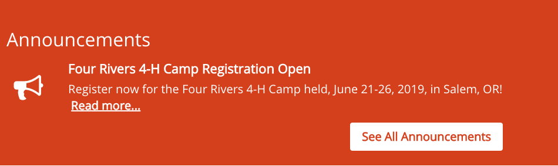

*Example announcement teaser on a landing page*

Announcements in a county or program group automatically show up for that county or program. They will also show up for counties and programs specified in the “additional counties” and “additional programs” fields. You can add an announcement to a topic page using the “announcement topic” field.

Teasers will only display during the dates specified in the “display dates” field.

## Article

### What It Is

A text-based piece of educational content. This is the preferred way to enter educational content owned by OSU Extension.

Articles stay on the site long-term, so they shouldn’t contain content that is only relevant for a short time. Use newsletter issues or announcements for these instead.

### Who Can Add It

Members of Content Team groups.

### Instructions

On the edit screen for an article, you will see the following fields:

  - **Title**: the title of the article
  - **Summary/deck**: a short description of the contents of the article that display in the teaser
  - **Content**: the full article content
  - **Images**: images that go with the article. These will display in a column on the right-hand side of the article’s text.
  - **Thumbnail**: image that displays in the article’s teaser. If this is empty, it will use the first image in the “images” field. If this is empty, it will use a default image based on the topic.
  - **Topics, Keywords, Programs, and Regions**: see below
  - **Author and Publishing Information**: information about the content for future maintenance.
    - If the content’s author is an OSU Extension employee, start typing their name into the first “Author(s)” field and select them when they come up. This will associate the content with their profile on the site.
    - If the content’s author is not an OSU Extension employee (including OSU employees who don’t have an Extension appointment), enter their information in the “Non-Extension Author(s)” fields.

**Quick Tip**: Web visitors often scan content on the web to see if it is useful for what they need. Make your article more readable by using these <ins>accessibility</ins> and [writing for the web](content-requirements.md#writing-for-the-web) tips.

### How and Where It

The tags in the “Topics, Keywords, Programs, and Regions” section of the edit screen determine where the article displays.

  - **Topic**: It will show in the “Browse All Resources” page for the specified topic(s). Other content tagged with the topic will show at the bottom of the article in a “Related Resources” section.
  - **Program**: If the specified program has added a “Program Tagged Content List” section to one of its pages, it will show up there. See the [Subpage](#subpage) section for more information.

Counties and Programs can display articles on a page by adding a “featured content” section.

## Collection

### What It Is

A grouping of existing pieces of educational content. Examples:

  - A series of articles or documents that make up a course
  - Content for a specific audience

Collections must be maintained by the content team. This can be time consuming. As new content is added to the website, it must also be manually added to the collection. This doesn’t happen automatically as it would for content tagged with a Topic (see [Displaying and Organizing Content on Other Pages](managing-content.md#displaying-and-organizing-content-on-other-pages) for more information). Collections may have gaps if new content is not added or if all related content wasn’t added when first creating the collection.

Collections serve a specific purpose and are not a solution for all needs, especially where the website is helping to organize the content too. You don’t usually need a collection for grouping content based on geographical region or topic. Filters on topic pages can accomplish this.

### Who Can Add It

Members of Content Team groups.

### Instructions

Before you create a collection, be sure to find (or add to the site, if needed) all the content that should be part of it.

On the edit screen for a collection, you will see the following fields:

  - **Title**: the title of the collection
  - **Short Description**: a summary of the collection’s contents that will show in the teaser
  - **Introduction**: text that will appear before the collection items
  - **Items**: the pieces of content in the collection
    - To add a piece of content, click “Add Collection Item.” Then click the “Select” button to open the content browser and select the piece of content.
    - **Troubleshooting Tip**: The content browser allows you to select multiple pieces of content for a single collection item. However, we recommend selecting only one at a time. This makes it easier to organize content: collection items can be reordered, but pieces of content in a single collection item will always be in the order they were selected.
    - To organize content into sections with titles, click “Add Collection Section.” This will provide you with fields where you can specify the title of the section and the pieces of content that appear in that section.
  - **For More Information**: text that will appear after the collection items
  - **Thumbnail**: image that will display in the teaser. If this is empty, it will use a default image based on the topic.
  - **Topics, Keywords, Programs, and Regions**: see below
  - **Author and Publishing Information**: information about the content for future maintenance
    - If the content’s author is an OSU Extension employee, start typing their name into the first “Author(s)” field and select them when they come up. This will associate the content with their profile on the site.
    - If the content’s author is not an OSU Extension employee (including OSU employees who don’t have an Extension appointment), enter their information in the “Non-Extension Author(s)” fields.

### How and Where It Displays

Collections display just like articles, educational documents, and other pieces of educational content. They display on topic and program pages based on the tags in the “Topics, Keywords, Programs, and Regions” section of the edit screen.

  - **Topic**: It will show in the “Browse All Resources” page for the specified topic(s). Other content tagged with the topic will show at the bottom of the collection in a “Related Resources” section.
  - **Program**: If the specified program has added a “Program Tagged Content List” section to one of its pages, it will show up there. See the [Subpage](#subpage) section for more information.

Counties and Programs can add collections to a page by adding a “featured content” section.

## County Office

### What It Is

Represents information about a county and content on its main page.

### Who Can Add It

These have been set up for you. No one can add or delete them.

### Instructions

The edit screen for a county office has three sections:

  - **Landing Page**: this is the main page visitors see for the county. The content on this page acts like a subpage. See the [Subpage](#subpage) section of this guide for more information.
  - **Sidebar**: You can add additional links to the sidebar on county pages. These will show up on every page associated with the county.
  - **County Info**: This is where you will be able to edit the location and contact information for a county.

**Quick Tip**: Members of county groups can feature educational content entered by Content Teams on their pages. See: [Organizing and Displaying Content on Other Pages](managing-content.md#displaying-and-organizing-content-on-other-pages).

### How and Where It Displays

There is a list of all counties on the [Find Us](https://extension.oregonstate.edu/find-us) page. The link to “Find Us” is in the top black menu bar at the top of every page. The sidebar on participant-based program pages also have links to the counties where that program is active.

## Educational Document

### What It Is

A document (PDF, Word Document, Excel spreadsheet, or PowerPoint presentation) containing educational information.

In almost all cases, educational documents would work better as articles. This makes the content more accessible, searchable, and maintainable. Articles can also be saved and printed. Content should only be an educational document if:

  - it is slides from a presentation,
  - it has a lot of complex, in-context graphics or formatting, or
  - it is a fillable or otherwise interactive document.

Educational documents are not appropriate for program forms, event information, driving directions, and other content that is not educational. Instead, these should usually be program resources, events, newsletters, or announcements.

**Quick Tip**: There are several options available for you to upload files. The best place depends on the audience the document is intended for, whether it will have new versions in the future, and whether it should be private to a certain group. See [File Management](content-requirements.md#file-management) for more information.

**Catalog publications should not be added as educational documents.** These are added and maintained by EESC.

**Important Note:** Be sure you have permission to share the file before you upload it to the Extension website. See Copyrighted Content.

### Who Can Add It

Members of Content Team groups.

### Instructions

On the edit screen for an educational document, you will see the following fields:

  - **Title**: the title of the document
  - **Document Type**: this will display as a label in the document’s teaser. It helps to provide context to visitors. If empty, “Educational Document” will display.
  - **Document Upload**: upload the document. When you upload from your computer, you will need to name the document again. You can use the title, the file name, or whatever will help you find it again if you need it in the future.
  - **Short Description**: a summary of the document’s contents that will show in the teaser
  - **Thumbnail**: the image that will show in the teaser. If this is empty and the document is a PDF, it will use an image of the first page of the document. If the document is not a PDF, it will use a default image based on the document’s topic.
  - **Topics, Keywords, Programs, and Regions**: see below
  - **Author and Publishing Information**: information about the content for future maintenance.
    - If the content’s author is an OSU Extension employee, start typing their name into the first “Author(s)” field and select them when they come up. This will associate the content with their profile on the site.
    - If the content’s author is not an OSU Extension employee (including OSU employees who don’t have an Extension appointment), enter their information in the “Non-Extension Author(s)” fields.

### How and Where It Displays

The tags in the “Topics, Keywords, Programs, and Regions” section of the edit screen determine where the educational document displays.

  - **Topic**: it will show in the “Browse All Resources” page for the specified topic(s)
  - **Program**: If the specified program has added a “Program Tagged Content List” section to one of its pages, it will show up there. See the [Subpage](#subpage) section for more information.

Counties and Programs can add educational documents to a page by adding a “featured content” section.

## Event

**Video:**

### What It Is

An event that a visitor to the website could attend. If it isn’t a gathering someone can attend, it shouldn’t be an event. This includes deadlines, office closures, and “services” such as a plant clinic or hotline. Instead, these should be announcements.

### Why Do This

  - Showcase and track the amount of on-the-ground programming that you do
  - Expand your outreach to local and new audiences about your events
  - Have a place to direct people for learning more and registering for the event
  - Can enter once and have it fed to the OSU calendar (and [Forestry Extension page](http://extensionweb.forestry.oregonstate.edu/) if relevant)
  - Be able to send specific events to interested people through future digital strategy
  - Find out which events are most viewed and by what audiences through analytics

### Who Can Add It

Any user on the site. If an event applies to more than one county or program, coordinate and make sure to add it only once.

**Quick Tip**: If an event has been entered that needs to be edited or removed from your page, you should contact the uploader of the event. See [“Working with Other Content Authors”](managing-content.md#working-with-other-content-authors).

### Instructions

On the edit screen for an event, you will see the following fields:

  - **All Day Event**: indicates that an event takes place all day. If checked, you will not need to fill in the time fields for the event date.

  

  - **Event Date**: the date(s) when the event occurs
  - **Event occurs multiple times in the specified period**: check this box if you are entering an ongoing event such as a plant clinic or hotline that has regular hours over the date range you specified. This will reveal a field where you can enter those hours more specifically.

    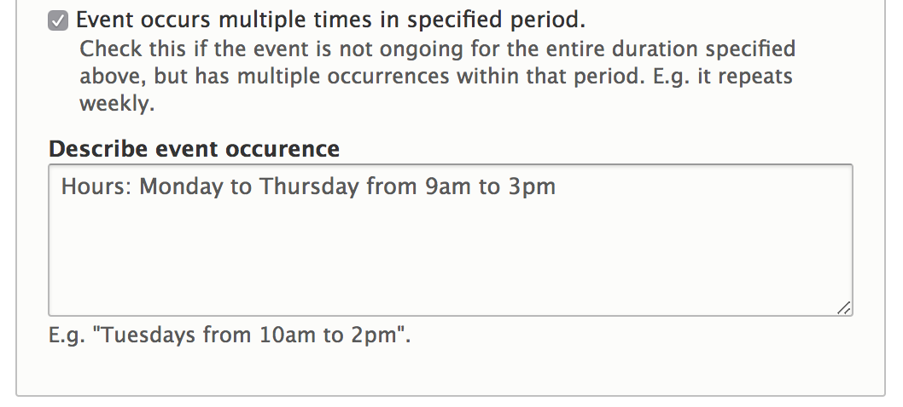

    We also recommend that you check the “All Day Event” box for these events in order to hide the time fields from the event date and prevent confusion.

  - **Short Description**: a short description of the event
  - **Full Description**: the full event description
  - **Event location fields**:
    - The field asks “Where will this event be held?”
      - If “At a county office,” then select the county office from the drop-down field that appears. The address field will get automatically filled in.
      - If “At another non-office location,” type the name of the location into the search field on the map. The address fields below will get automatically filled in.
        - If the address is not yet known or private, type “To Be Determined” or “To be provided to registrants” in the location name. Then enter the city, state, and ZIP code.
      - If “Online-only,” no address needs to be provided.
    - **Room/building number**: include if needed
    - **Troubleshooting Tip**: If you change an event from an existing location to a custom address, the old location may still show when you save. To correct this:
      1. For the field “Where will this event be held?” select “At a county office.”
      2. Change the drop-down list  to --None-- which unsets the existing location.
      3. Click the “At another non-office location” button and enter the new address.
      4. Save.
  - **Event Cost**: how much it costs to attend the event
  - **Registration Link**: a link to register for the event online. If you enter the link here, you don’t need to enter it in the description.
  - **Contact name, email, and phone**: person to contact with questions about the event. This information is required by OSU’s calendar system, which pulls events from the Extension website.
  - **More information or promotional flyer**: uploaded flyer or registration form for the event

    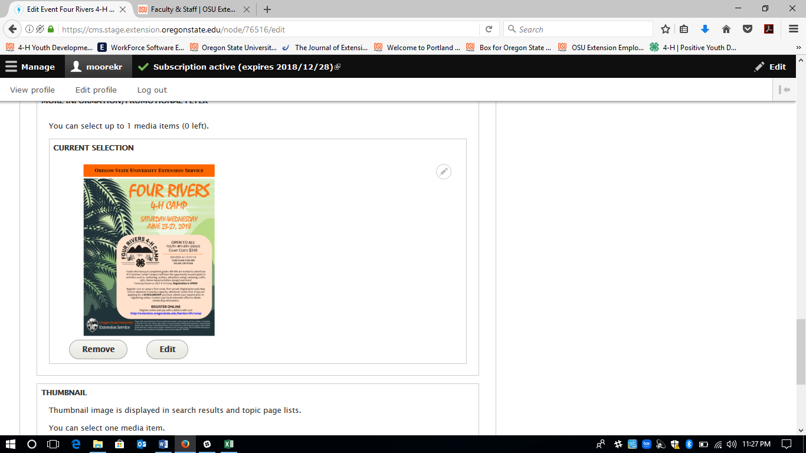

    - Important Note: For accessibility, it is important that any information in a flyer is also included in another field on the event (e.g., in the full description field). See [Accessibility]().
  - **Thumbnail**: an image for the event

    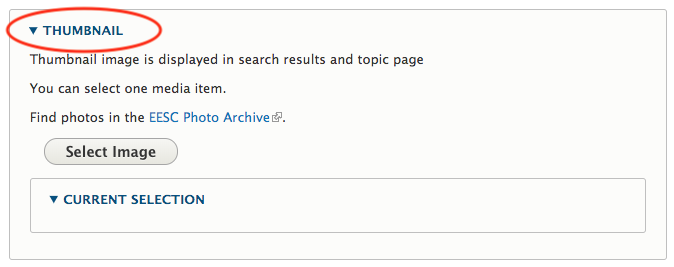

  - **Additional calendar**: used to export events to other calendars and create narrowed-down event lists on program and county pages
  - **Additional counties or programs**: other counties and programs where the event should show. You don’t need to include the county or program you are using to enter the event.
  - **Topics**: specifies which topic pages the event should show on.

### How and Where It Displays

Event teasers will only display on pages until the event ends. They contain the event title, dates, and the city in which it takes place (or “Online” if it is a webinar). They show on the following pages on the site:

  - Topic pages: events tagged with the topic in the “Topics, Programs, and Counties” section of the edit screen
  - Program pages: events entered by the program’s group or tagged with the program in the “Topics, Programs and Counties” section of the edit screen.
  - County pages: events entered by the county’s group or tagged with the county in the “Topics, Programs, and Counties” section of the edit screen.
  - County subpages: Members of a county group can set up event lists on subpages that only show a subset of events for that county. These events must be:
    - added through the county group or tagged with that county, and
    - tagged with a specified additional calendar.

All Extension events will be automatically exported to OSU’s main calendar, **Localist**. Some important notes about this process:

  - Localist pulls events from the Extension website each night.
  - It pulls both new events and updates to existing events.
  - Uploaded flyers or other documents on the event will only display on the Extension website, not Localist.
  - If you delete an event before it is over (e.g., if you noticed it was a duplicate), it will show as “cancelled” in Localist.

The FNR Extension website pulls events from the Extension website when “Forestry Extension” is selected under “additional calendars.”

## Newsletter Issue

### What It Is

Newsletter issues can be documents, links to an email newsletter service, or content entered into the website. They are organized into newsletter containers. For example the [*GROWING*](https://extension.oregonstate.edu/newsletter/growing) newsletter *container* includes the *issues* for Nov/Dec, Sept/Oct, July/Aug, etc.

### Who Can Add It

Any user can add newsletter issues. However, you must enter an issue of a newsletter through the *same group* as the newsletter it belongs to.

### Instructions

**Step 1: Create the Newsletter Container**

The **first time** you upload a newsletter, you will need to create a container to hold all the issues together. To do this, go to the edit screen for a Newsletter Issue. Then click the “create a Newsletter container” link under the dropdown list of available newsletters.

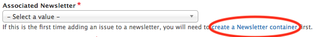

**Step 2: Create Issues for the Newsletter**

On the edit screen for a newsletter issue, you will see the following fields:

  - **Title**: a title distinguishing it from other Issues (e.g. “GROWING: May - June 2018”)
  - **Associated Newsletter**: the newsletter to which this issue belongs
    - **Troubleshooting Tip**: If the newsletter you want isn’t in the list, one of two things is happening:
      1. you aren’t adding the issue through the group the newsletter belongs to, or
      2. the newsletter hasn’t been created yet.
  - **Issue Type**: “Web Content,” “File Upload,” or “Link to Issue”
    - File Upload Issues: This type of issue consists of a document uploaded to the website. When you choose this option, you will see a file upload field.
    - Linked Issues: This type of issue consists of a page or document hosted on another website. This includes newsletters sent via MailChimp or in Box. When you choose this option, you will see a field to enter the URL of the issue.
    - Web Content Issues: This type of issue consists of content entered into the website. When you choose this option, the newsletter issue acts like a subpage. See [Page Sections](using-site.md#page-sections) for information about adding and arranging content on the page.
    - **Short Description**: the Table of Contents or description of what visitors can find in this issue.
  - **Author and publishing information**: Previous issues are arranged based on the “Date Published or Revised” entered here.
    - If the content’s author is an OSU Extension employee, start typing their name into the first “Author(s)” field and select them when they come up. This will associate the content with their profile on the site.
    - If the content’s author is not an OSU Extension employee (including OSU employees who don’t have an Extension appointment), enter their information in the “Non-Extension Author(s)” fields.

**Quick Tip**: Web visitors often scan content on the web to see if it is useful for what they need. Make your newsletter content more readable by using these [accessibility]() and [writing for the web](content-requirements.md#writing-for-the-web) tips.

### How and Where It Displays

Newsletter containers display automatically on topic and program pages based on their tags.

They can also be added to topic landing pages, program pages, and county pages by adding a “Featured Content” or “Featured Resources” section.

Newsletter issues display in a list on a single page for their Newsletter container.  

#### Displaying Newsletter Sign-Up Forms

If you have a form people can use to sign up for your newsletter, there are several ways to display it on the site.

  - On the edit screen for the Newsletter container, there is a field for a “subscribe link.” You can enter a link to the form and it will display above the list of the issues for that newsletter.
  - If you want to add a link to the form on a program or county page, you can add a “button link” on the desired page. See the [Subpage](#subpage) section below for more information.
  - MailChimp and other email management systems often give you an embed code so you can display the sign-up form directly on a web page. [Here are instructions for how to get an embed code from MailChimp.](https://mailchimp.com/help/add-a-signup-form-to-your-website/) Once you have the embed code, add a “Text” section to the page. Click the “Source” button in the text editor to switch to HTML mode and paste the embed code there. You will see the form on the page when you click “Save.”

## Online Resource

### What It Is

A link to educational content housed on another site. Use this for any content that is copyrighted by another organization.

### Who Can Add It

Members of Content Team groups

### Instructions

On the edit screen of an online resource, you will see the following fields:

  - **Title**: the title of the resource
  - **Website URL**: the link to the resource
  - **Short Description**: a description of the resource
  - **Thumbnail**: an image to go with the resource. If empty, it will use a default image based on the tagged topic.
  - **Topics, Keywords, Programs, and Regions**: see below
  - **Author and Publishing Information**: information about the content for future maintenance
    - If the content’s author is an OSU Extension employee, start typing their name into the first “Author(s)” field and select them when they come up. This will associate the content with their profile on the site.
    - If the content’s author is not an OSU Extension employee (including OSU employees who don’t have an Extension appointment), enter their information in the “Non-Extension Author(s)” fields.

### How and Where It Displays

The tags in the “Topics, Keywords, Programs, and Regions” section of the edit screen determine where the online resource displays.

  - **Topic**: it will show in the “Browse All Resources” page for the specified topic(s)
  - **Program**: If the specified program has added a “Program Tagged Content List” section to one of its pages, it will show up there. See the [Subpage](#subpage) section for more information.

Counties and Programs can add online resources to a page by adding a “featured content” section.

## Program

### What It Is

A **program** on the Extension website is an *externally facing* activity that members of the public can participate in. Examples include 4-H programs and the various Master training programs.

This definition is narrower than what people in Extension normally mean by “program.” It’s not an industry-focused program, informational center program, or Extension program area. These can be highlighted in projects, topic pages, or county “focus areas,” which is a new content type coming in early 2019.  

**Program** | **Project** | **Topic Page**
------------|-------------|---------------
- Public participation or local engagement is a key component.  - Web content updates regularly and participants need to access it frequently. | - Extension activity with impact or outputs that are of interest to the public.  - Often includes partnership with external organizations.  - May seek *input* from the public (e.g., a survey), offer courses, or provide targeted information, but not ongoing participation. | - Ongoing high-level activity area such as “Dairy Extension” or “Fire Program.”  - Experts collaborating in working groups that develop educational materials.  - May also include events, projects, and participatory programs.

Most programs have a single main **“statewide” program** group that maintains content. Counties can point visitors there and add some locally relevant information if applicable. However, some programs (namely, 4-H and Master Gardener) have dedicated staff for maintaining specific local content. These have **local program** groups in addition to the statewide program group.

### Who Can Add It

These have been set up for you. No one can add or delete them.

### Instructions

The edit screen for a program has three sections:

  - **Landing Page**: This is where you control the content on the program’s landing page. It acts like a subpage. See the [Subpage](#subpage) section of this chapter for more information.
  - **Sidebar**: You can add additional links to the sidebar on program pages. These will show up on every page associated with the program.
  - **Program Info**: This is where you can edit the description, thumbnail image (photo or square graphic companion logo that has been approved by OSU), tags, and other information for the program.

**Quick Tip**: Members of program groups can feature educational content entered by Content Teams on their pages. See: [Organizing and Displaying Content on Other Pages](managing-content.md#displaying-and-organizing-content-on-other-pages).

If your program has an existing website, you can enter the link in the “Program Info” section of the edit page. Visitors will go directly to this site when they click on the program. If you would like to have a short description about the program, show faculty or staff, and add events or newsletters to show here and other places on the Extension website, before directing people to the external site, do not add the link to the “Program Info” section. Instead hyperlink to it on the program landing page using a “Button Link” section.

### How and Where It Displays

There is a list of all programs on the [programs page](https://extension.oregonstate.edu/programs). This is in the top black menu bar at the top of every page under “Get Involved.”

You can tag a program with topics and counties in the “Program Info” section of the edit screen. This will create a link to the program on the landing pages of the specified counties and on the Get Involved menu on the specified topic pages.

## Program Resource

### What It Is

A document or link that is necessary for participation in a program (see definition of program above). Examples include forms, policies, or procedures. These should be items that are *only of interest to participants in a specific program*.

It is very important that educational materials that are useful to the general public **NOT** be entered as program resources but rather another content type through a Content Team group. Program resources are only seen and needed by participants in a program, and so are more difficult for a general audience to find.

### Who Can Add It

Members of Program groups

### Instructions

On the edit screen for a program resource, you will see the following fields:

  - **Resource Type**:
    - Selecting “External Website” will provide a field for you to enter a URL.
    - Selecting “Document” will provide a field for uploading a document. You can also specify alternate versions of the file. This is for documents that are available in multiple formats (e.g. PDF, Word) or languages. The different versions are differentiated by the names you give them when you upload them.

      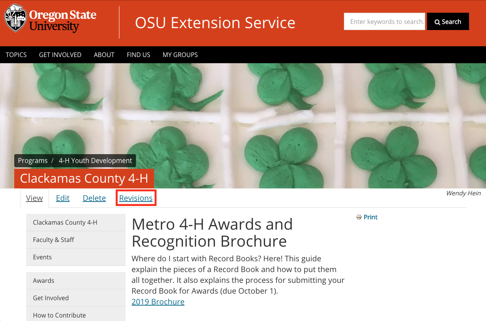

      *Example of a program resource with multiple file versions.*

  - **Description**: a description of the resource that displays in the teaser
  - **Type**: This field is for organizational purposes and will not affect how the program resource displays to visitors to the site. If none fit, select “Other.”
  - **Category**: To organize program resources, you can configure categories for them (see below).
  - **This resource is for active program volunteers**: This is for internal informational purposes only. In the future, it could be used to pull information into a volunteer management solution Extension may adopt.
  - **Thumbnail**: an image for the resource that displays in the teaser. If empty and the resource type is “document,” it will use an image of the first page of the document.

**Quick Tip**: If you will need to replace a program resource document with a new version in the future, consider taking advantage of the file versioning functionality available in Box. See: [File Management](content-requirements.md#file-management) for more information.

#### Managing Program Resource Categories

To tag a program resource with categories, you must first create the categories. Categories are program specific. Every program group (including local program groups) has its own set of categories.

To add or edit a category, go to the Group Content page for the group the resource is in. Click the “Categories” link at the top of the page.

This will take you to a page with a list of available categories. It also shows how many resources are tagged with each category and how many page sections are set up to display that category.

When you add or edit a category, you can enter both a name and a description. These are only visible on edit screens and won’t show publicly to visitors to the site.

### Where and How It Displays

Program Resources display in “Program Resource List” sections on program subpages. These are sorted alphabetically by default, but you can customize the order. See the [Subpage](#subpage) section below for more information.

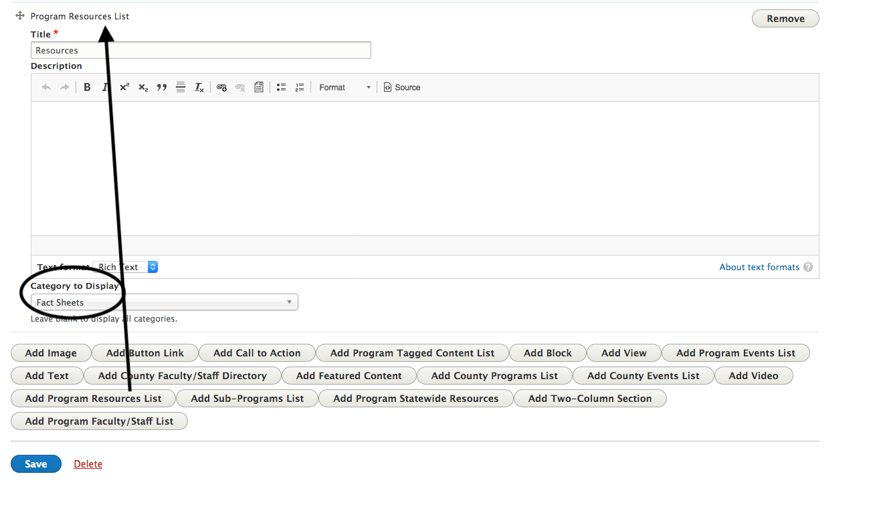

Local programs can display program resources from their statewide program. To do this, add a “Program Statewide Resource List” section to a page. You can narrow the resources shown by the categories configured by the statewide program.

#### Case Study: BBB Program Resources
Better Bones and Balance uses categories to organize their Program Resources:

Their program subpages roughly correspond to these categories:

  - DVD -> Better Bones and Balance Store Items
  - Fact Sheets -> Research & Publications
  - Instructor Resources -> Instructor Resources
  - Recertification -> Become a BBB Instructor
  - Research -> Research & Publications
  - Sample Lessons -> Instructor Resources

## Project

### What It Is

A **project** on the Extension website is an Extension activity with impact or outputs (such as a toolkit or calculator) that are of interest to the public. They often include partnerships with external organizations.

Projects differ from programs in that they do not involve ongoing participation with members of the public, such as volunteering or increasing levels of involvement. However, projects may seek public input through surveys, offer courses, or provide targeted information.

### Who Can Add it

Members of content team groups.

### Instructions

The edit screen for a project has the following fields:

  - **Short description**: a description of the Project that shows up in the tease.
  - **Thumbnail**: an image representing the Project that shows up in the teaser
  - **Website URL**: If your project already has it’s content on an external website, you can enter the link here. Visitors will be taken directly to that site when they click on the Project.
  - **Content**: the content that shows on the Project’s page (see [Page Sections](using-site.md#page-sections) for more information). The following types of sections are available to add to the page:
    - **Image**: an uploaded image
    - **Button Link**: a link styled as an orange button
    - **Text**: formatted text
    - **Featured Content**: links to other content on the site
    - **Project Materials List**: uploaded documents or links to other sites displayed in a list
    - **Project Columns**: allows you to display other sections in two columns (on large enough screens)
    - **Video**: a video hosted on YouTube, Vimeo, or OSU Media Space
    - **Tabbed Section**: allows you to display other sections in tabs, where only one tab is displayed at a time and visitors can switch between them

      

  - **Tags**: includes topic, program area, program, and counties

### Where and How It Displays

There is a list of all projects on the [projects page](https://extension.oregonstate.edu/projects). This is in the top black menu bar at the top of every page under “Get Involved.”

If you tag a Project with a topic, it will show up on the “Our Work” page for that topic. Topic committees may also feature projects on the topic landing page. Programs and counties can add projects to their pages by adding a “featured content” section and selecting the Project.

## Project Supporting Material

### What It Is

Content that provides context or additional information about a Project (see above). This may include instructions for use of the Project’s outputs, links to surveys, links to purchase options, or information about supporting the project.

### Who Can Add It

Members of Content Team groups.

### Instructions

The edit screen for a project supporting material has the following fields:

  - **Associated Project**: the project that the material supports. This is necessary because a content team may contain more than one Project.
  - **Type**: the type of material. This is used for informational or organizational purposes only, and isn’t seen by the public.
  - **Website URL**: If your project already has it’s content on an external website, you can enter the link here. Visitors will be taken directly to that site when they click on the Project.
  - **Content**: the main text that shows on the Material’s page
  - **Page Sections**: additional content that shows on the Material’s page (see [Page Sections](using-site.md#page-sections) for more information). The following types of sections are available to add to the page:
    - **Image**: an uploaded image
    - **Button Link**: a link styled as an orange button
    - **Text**: formatted text
    - **Text with Background**: formatted text with a background image that spans the entire screen
    - **Featured Content**: links to other content on the site
    - **Project Materials List**: uploaded documents or links to other sites displayed in a list
    - **Project Columns**: allows you to display other sections in two columns (on large enough screens)
    - **Video**: a video hosted on YouTube, Vimeo, or OSU Media Space
    - **Call to Action**: text, image, and link to encourage visitors to the page to take an action

### Where and How it Shows Up

All supporting materials tagged with a Project will show up in a sidebar on that Project’s page.

By default, the newest materials show up at the bottom of the sidebar. If you are a member of the group that contains the Project, you can customize the order of materials in the sidebar by clicking the “Reorder Pages” button at the bottom of the sidebar. This will take you to a page where you can drag and drop the materials into the order that you want. To nest one page under another, drag the nested page beneath it’s parent and then to the right. To un-nest a page, drag it back to the left. When you are done, click the “Save” button.

## Subpage

### What It Is

A customizable page for organizing content and providing additional context or information.

**Quick Tip**: Web visitors often scan content on the web to see if it is useful for what they need. Make your page’s content more readable by using these [accessibility]() and [writing for the web](content-requirements.md#writing-for-the-web) tips.

### Who Can Add It

Members of program and county office groups.

### Instructions

The edit screen for a subpage contains fields for the page title, hero image, and some basic text content. The hero image displays as a banner at the top of the page, so it should be about 2000px wide by 400px high. If this is empty, it will use the hero image of the county or program in its group.

Content for subpages is primarily added through page sections (see [Page Sections](using-site.md#page-sections) for more information). These types of sections are available to all subpages:

  - **Button Link**: a link to another page (in or outside of the Extension site) styled as a large orange button
  - **Call to Action**: a link to another page (in or outside of the Extension site) that includes a description and image
  - **Featured Content**: links to content in the Extension site
  - **Image**: an image with optional caption and alternative text to describe the photo
  - **Quick links bar**: an orange bar across the page that can contain links to social media or important pages
  - **Text**: a simple text box with formatting such as bold or italic
  - **Text with background**: a text section with a background image that stretches all the way across the page. This image should be at least 2000px wide.
  - **Two-Column Section**: allows you to display other sections in two columns instead of one (in large enough screens)
  - **Video**: an embedded video from YouTube, Vimeo, or OSU Media Space

Additionally, more sections are available depending on the page’s group type.

County sections:

  - **County Events List**: shows a list of events that have either been added by the county or tagged with the county by another group. You can specify an “additional calendar” to only show events tagged with that calendar.
  - **County Faculty/Staff Directory**: shows a list of people tagged with the county.
  - **County Programs List**: shows a list of programs tagged with the county.

Program sections:

  - **Program Events List**: shows a list of events that have either been added to the program or tagged with the program by another group.
  - **Program Resources List**: a list of program resources associated with the program.
    - When you add this section, you can specify one or more “Category to display.” Only resources tagged with all specified categories will show in the section.
    - If there are no program resources with the specified category, the program resource list will not show up and the “title” and “description” will stay invisible to the public. If you want the description text to be visible on the Subpage regardless, it’s best to use a “Text” section instead.
    - By default, resources are sorted alphabetically. You can reorder the resources in a list by hovering over the list, clicking the pencil icon that appears to the right of the title, and selecting “Reorder items.” This will take you to a page where you can drag and drop the resources into the order you want. Click save and you will go back to the page you were on.

      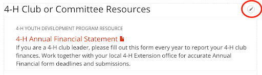

    - You will not see the resources pulled in to the section until you click “Save” and view the page.
  - **Program Statewide Resources**: a list of program resources associated with the local program’s statewide “parent.” This is currently applicable only to 4-H and Master Gardener.
  - **Program Tagged Content List**: an automatically generated list of content in the site that has been tagged with the program.
  - **Statewide Program Events List**: shows a list of events that have been entered by a local program’s statewide “parent.”

**Quick Tip**: For help featuring educational content entered by Content Teams on their pages, see: [Organizing and Displaying Content on Other Pages](managing-content.md#displaying-and-organizing-content-on-other-pages).

### Where and How It Displays

Subpages display in county or program sidebars. You can reorder subpages in the sidebar by clicking the “Reorder Pages” button at the bottom of the sidebar.

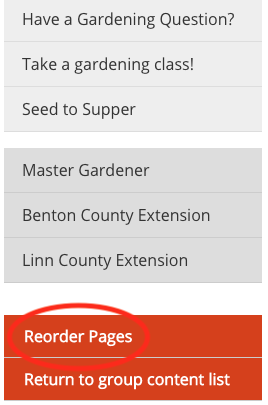

This will take you to a page containing a list of pages in the sidebar.

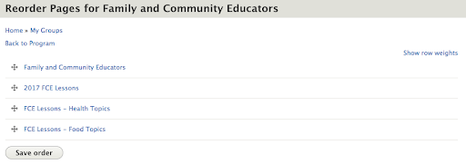

Use the arrow controls next to each page to drag them into the order you want. When you’re finished, click the “Save Order” button at the bottom of the page.

To nest one or more pages under another, drag the nested page to the right and you’ll see it slightly indented. You can do this for as many menu pages as you would like, but only one level down. If you want a page to no longer be nested, drag it back to the left.

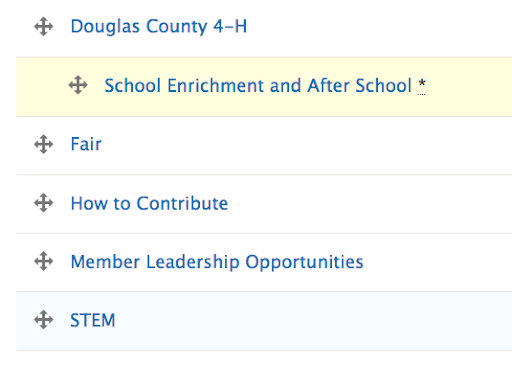

Note that sidebars contain some automatically generated pages at the top, above the listed subpages, that cannot be reordered.

You can add links to external sites, such as a college or association site, to the bottom of the sidebar. To do this, edit the program or county the sidebar belongs to. Open the “Sidebar” tab on the edit screen and click the “Add Button Link” button.

## Topic Page

### What It Is

A “topic page” actually consists of several pages, which are listed in a menu across the top of the landing page:

  - **Landing Page (“home” for the topic)**: the first page visitors see when they click on a topic. Here is a list of what this page itself consists of (items marked with a “\*” are customizable by topic committees):
    - **Hero image\***: large image across the top of the page
    - **Short description\***: one or two sentences about the topic and the work Extension does relating to it
    - **Resource lists\***: can be configured as needed
    - **About section\***: more in-depth information about the topic and Extension’s work, optionally with a large background image
    - **Explore more resources\***: links to other topic pages that contain content that may be of interest to visitors
    - **Upcoming events**: the three closest upcoming events tagged with the topic
    - **Meet our experts\***: if experts are selected by the topic committee, they will display here. Otherwise, the first four people with their “Expertise” set to the topic will display in alphabetical order
    - **Ask an Expert**: for people to submit questions
  - **Browse Resources**: all content in the site tagged with the topic
  - **Events**: all upcoming events tagged with the topic
  - **Get Involved**: all programs tagged with the topic
  - **Our Work**: all projects tagged with the topic
  - **Our Experts**: all users with their Expertise set to the topic

If there isn’t any content on a page, the link won’t appear in the menu.

**Quick Tip**: For guidelines to help decide what content to feature on a Topic Page, [Planning and Evaluating Content](content-requirements.md#planning-and-evaluating-content).

### Who Can Add It

Topics are set up by the EESC web team. No one can add or delete a topic, but topic committee members are able to edit certain sections of the landing page. If you have content that doesn’t fit into an existing topic, you can request a new one for consideration. The following criteria are used to determine whether something should be a topic on the site:

  - There is a reasonable amount of content for the topic
  - At least one content team is associated with the topic
  - User feedback or other data supports the need for the topic
  - The topic has a user-friendly label, meaning:
    - it is appropriate for its audience (e.g., if the content is generally targeted or industry targeted), and
    - there evidence that web visitors understand and use the term.
  - Other Content Teams that have entered or would enter content for the topic have been consulted and are willing to help with retagging content from their group.

You can request a new topic by submitting a [support request](https://osueesc.atlassian.net/servicedesk/customer/portal/2).

The educational content that shows on topic pages is entered by content teams. A single topic page may showcase content from multiple content teams, and a single content team may enter content for multiple topics. Topic Committee groups are responsible for featuring content on topic pages. See [Getting Started with Content - Topic Committees](getting-started.md#topic-committees) for more information.

### Instructions

On the edit screen for a topic landing page, you will see the following fields:

  - **Hero image**: the large image across the top of the page. Please use an image that is at least 2000px wide and 325px tall. When uploading an image, please be sure to set the “**focal point**” so it will display properly on all screen sizes.

    

  - **Description**: the short block of text that appears at the top of the page. Limit this to one or two sentences.

    

  - **Related Topics**: creates links on the topic landing page to other topics.

    

  - **About Section**: Click the “Add Text with Background” button to enter a longer description of the topic and an image to use as a background. Please use an image at least 2000px wide and tall enough to be a backdrop to the text you write. Remember to set the focal point when uploading it.

    

  - **Landing page sections**: You can add two different types of sections to the page:
    - **Custom topic section**: a section title (e.g., “Featured Resources”), several pieces of manually selected content, and a manually entered link to see more content. A good option here is to use a link to the topic’s “Browse Resources” page with one or more filters already applied. Examples may be specific subtopics such as “Nutrients” or audiences such as “Coastal Region.” More than one Custom topic section can be added to highlight frequently looked for categories.
    - **Latest topic content**: the newest three pieces of content tagged with the topic. It can be narrowed by content type to, for example, show only the newest three videos or Extension Catalog publications. More than one of these sections can be added.

      
      

  - **Featured experts**: Enter the ONID usernames (not full names) of the people to show in the “Meet Our Experts” section. If none are selected, the first four people in alphabetical order with their “Expertise” set to the topic will show up.

    

### Where and How It Displays

The black menu bar at the top of every page contains a list of all topics. There are also links to all top-level topics on the home page.

We encourage counties to link to topics that are especially relevant to visitors from their county. This can be done via a “Button Link” or “Call to Action” section.

## User Profile

### What It Is

Information about a person. This includes contact information and information about the work they do.

### Who Can Add It

All users on the Extension website are able to edit certain parts of their profile. This includes users who are not a member of any groups.

### Instructions

To get to the edit screen for your profile, click on the “My Account” link in the footer of any page:

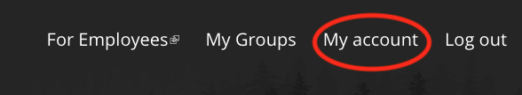

Then, click on the “Edit” tab at the top of your profile. The fields you are able to edit are in the “Profile” tab on the left-hand side of the edit screen.

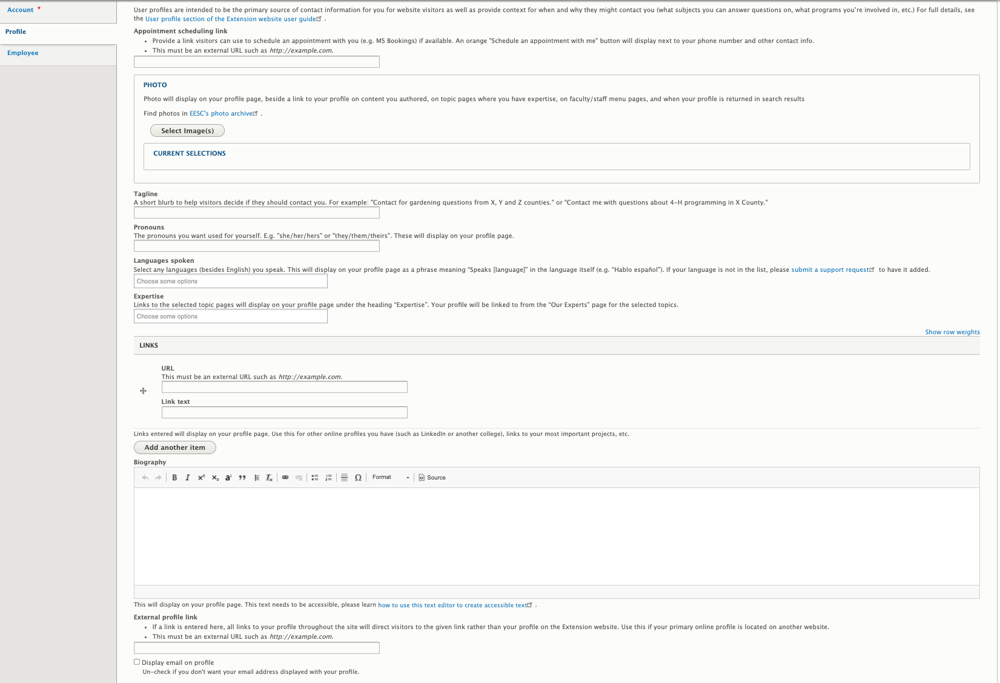

On the edit screen for your profile, you will see the following fields:

  - **Photo**: a photo of yourself.
  - **External profile link**: If you have a profile on another college website, you can link to it here. Visitors who click on you will go there directly.
  - **Biography**: information about yourself and your work, including links or lists of publications.
  - **Expertise**: the topic(s) in which you work. Selecting a topic here will list you as an “Expert” on that topic page. Feel free to list expertises that are not in the topic list in your Biography field.
  - **Website URL**: You can link to other websites with information about you, such as a LinkedIn account.

For changes to other information, please submit a support request.

### Where and How It Displays

The black menu bar at the top of every page contains a link to the [faculty and staff directory](https://extension.oregonstate.edu/people/directory). This is a list of all people in Extension.

There are also narrowed-down directories on program, county, and topic pages. These depend on the tags given to the user.

People can also be found by typing their name in the Search field at the top of every page.

## Video

### What It Is

An informational video.

### Who Can Add It

Members of content team groups. Note that members of county and program groups can add videos directly to their pages. See the [Subpage](#subpage) section for more information.

### Instructions

On the edit screen for a video, you will see the following fields:

  - **Video**: You can embed a video from YouTube, Vimeo, or OSU Media Space.
  - **Description**: a short description of the video. This is shown in the teaser as well as the full video page.
  - **Supplemental text**: additional text to show on the full video page.
  - **Topics, Keywords, Programs, and Regions**: See below.
  - **Author and Publishing Information**: information about the content for future maintenance.
    - If the content’s author is an OSU Extension employee, start typing their name into the first “Author(s)” field and select them when they come up. This will associate the content with their profile on the site.
    - If the content’s author is not an OSU Extension employee (including OSU employees who don’t have an Extension appointment), enter their information in the “Non-Extension Author(s)” fields.

**Important Note**: All videos produced by or for Extension should be captioned for accessibility. See [Accessibility]() for more information.

### How and Where it Displays

The tags in the “Topics, Keywords, Programs, and Regions” section of the edit screen determine where the video displays.

  - **Topic**: It will show in the “Browse All Resources” page for the specified topic(s). Other content tagged with the topic will show below the video in a “Related Resources” section.
  - **Program**: If the specified program has added a “Program Tagged Content List” section to one of its pages, it will show up there. See the [Subpage](#subpage) section for more information.

Counties and Programs can add videos to a page by adding a “featured content” section.

## Review of Terms

  - **Teaser**: a condensed version of a piece of content that links to a separate page containing the full content. These usually contain the title, a thumbnail, and a short description of the content.
  - **Educational content**: research-based materials that are meant to *inform visitors about a topic*
  - **Thumbnail**: image representing content that will display in the content’s teaser. If none is specified for a piece of content, a default will be used if possible
  - **Landing page**: the “main” page for a participant-based program, county, or topic
  - **Localist**: OSU’s university wide calendar system. Automatically pulls events entered in the Extension website nightly.
  - **Program**: an *externally facing* activity that members of the public can participate in
  - **Statewide program**: the main group that maintains content for a program
  - **Local program**: offshoot of a program that maintains content for a specific county or geographical region
  - **Project**: an activity with impact or outputs (such as a toolkit or calculator) that are of interest to the public
  - **Focal point**: specified point in an image that controls how the image is cropped when it is automatically resized. Set by moving the white “+” icon on the image preview in the image browser that appears when uploading or editing an image.
