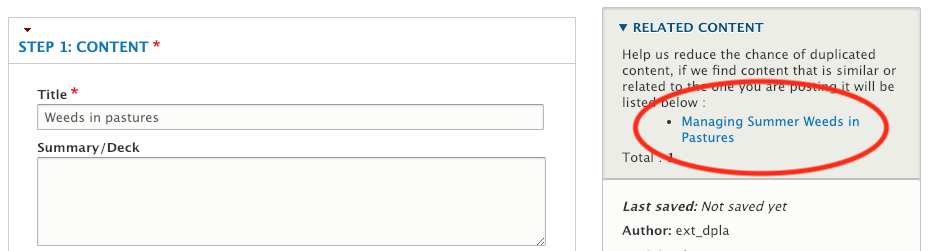
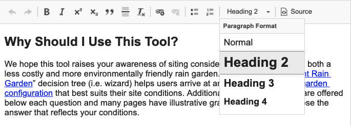
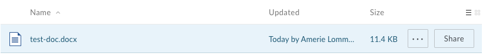
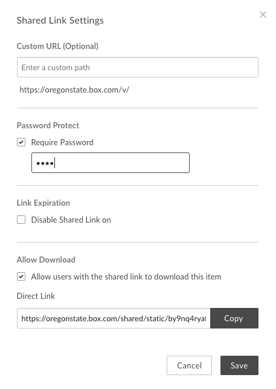

# Content Requirements and Best Practices

Here are requirements and best practices to keep in mind as you create and enter content for OSU Extension. Most of these apply to the Extension website and elsewhere, such as OSU WordPress blogs and college or department websites.

## Planning and Evaluating Content

Before you enter content, you should evaluate whether that content is appropriate to put online. All content should:

  - Have a **purpose or goal** that aligns with your team’s strategy
  - Have a defined **audience** and be appropriate for that audience
  - Align with the digital strategy’s **requirements and guiding principles**
    - **Structured**: entered in a format that makes sense and is consistent
    - **Atomic**: separated into the smallest sensible pieces
    - **Customer-focused**: uses language and concepts that are familiar to visitors
    - **Mobile-friendly**: deliverable to a variety of screen sizes without degradation
    - **Data-informed**: creation and development based on available data
    - **Relevant**: information is up-to-date and meets visitors’ needs
    - **Right people doing right things**: written, reviewed, entered, and maintained by the appropriate people and groups
  - **Not duplicate** content that already exists online
    - Before entering content into the Extension website, please use the [Site Content Overview](https://extension.oregonstate.edu/content/overview) page to make sure it doesn’t already exist.
    - When entering content, you can see a list of existing content with similar titles in the right-hand section of the screen:

      

    - If the content you want to enter already exists, contact the person who uploaded it and ask them to make the necessary edits. [See Working with Other Content Authors](managing-content.md#working-with-other-content-authors). If the content is on another website, consider linking to it instead.

## Writing for the Web

Many Extension faculty and staff are skilled in academic research writing or in writing program materials. This type of content often needs to be altered to accommodate the way that people use information online.

Here are some tips for writing effective web content:

  - **Keep it as short as possible.** Remove words, sentences, paragraphs, and pages that aren’t necessary.
  - **Separate content into chunks** using lists, headings, and paragraph breaks.
  - **Don’t over-emphasize.** When everything on a page is emphasized, nothing stands out. Avoid overuse of bold, italics, and large or colored fonts. The best way to bring attention to something is to have less other stuff on the page to compete with it (see the first tip).
  - **Use good writing style** as you would with any other piece of writing.
    - Use proper spelling and grammar.
    - Try to use active verbs.
    - Begin a piece with something interesting and lead with important points.
    - Make titles descriptive and compelling.
    - Limit acronyms and jargon.
  - **Use clear language** by writing simple, straightforward descriptions whenever possible, especially when translation is not an option. This also makes content more usable for youth, people with low-literacy, English language learners, and people with certain learning or intellectual disabilities. [Hemingway App](http://www.hemingwayapp.com/) is a good tool to check the readability of your content.
  - **Set up a review process** so that content stays up to date and is accurate. (For some content teams, this may include peer review.)
  - **Follow OSU and Extension brand guidelines.** The [OSU Brand Guide](https://communications.oregonstate.edu/brand-guide) and the [Extension Style Guide](https://employee.extension.oregonstate.edu/resources/marketing-tools/osu-extension-style-guide) have information about messaging and tone for written pieces.

## Diversity and Inclusion

OSU’s Strategic Plan 4.0 places a strong emphasis on promoting diversity and inclusion in education and programs. There are several things to keep in mind to ensure that our web content is inclusive of all the audiences we serve.

### Accessibility

**Accessibility** means that content is available to and used by a diverse variety of visitors. Often, it specifically refers to making a site useable by people with disabilities. However, it can also apply to others, including:

  - People using small screens on mobile devices
  - English-language learners and automatic translators that may be used by non-English speakers
  - People of diverse ages
  - Non-human visitors to the site, such as search engine crawlers

As an institution that receives federal funding, we are **legally required to make content and services accessible**. See OSU’s [IT Accessibility Policy](https://accessibility.oregonstate.edu/itpolicy). Here are some guidelines to make sure content is accessible:

  - **Use text editor controls for what they were intended.** Many assistive technologies depend on text formatting to give structure and meaning to content. Therefore, it’s important to use formatting only when appropriate. For example, don’t create a “fake” heading by just making text bold. On the other hand, don’t use the heading formatting (e.g. Heading 2, Heading 3) just to emphasize text. Headings should reflect the structure of the content.

    

  - **Don’t put important text in images.** People with visual impairments can have trouble reading text that is part of an image. Text in images also cannot be translated by automatic translators or scanned by search engines. Text in images such as event flyers and diagrams should also be typed in another field on the content, such as the description field on an event. If you must put text in an image, also type that text in the image’s alternative (“alt”) text field.
  - **Use meaningful labels for links.** It is important that the text in a link makes sense and describes what the link does. If the link gets broken, you will find it easier to locate the resource again if the link includes the title of the missing page. Assistive technologies often read link text by itself to help speed up browsing. Also, search engine crawlers put more weight on keywords in link text.
    - You should never use a “raw” URL. For example, instead of “www.google.com,” use “Google.” See [Using the Site](using-site.md#links) for how to create links in text areas.
    - The same thing applies to email addresses. Instead of “Contact Jane Doe at jane.doe@oregonstate.edu,” just put “Contact Jane Doe.”
    - We also encourage you to link to a person’s profile instead of an email address if possible (type their name in the link field and select from the list that shows up). This has several benefits:
      - Makes it less likely for spam bots to find and abuse the email address.
      - Profile links go to an online form which results in less errors than clicking on an email link.
      - Profiles also give several methods of getting in touch with someone for visitors that prefer one method over the others.
    - Avoid links that contain the phrase “Click here.” This is not descriptive enough and is inaccurate for people who are not using a mouse.
  - **Avoid text in all caps.** This makes text difficult to pronounce for screen readers (they may mistake it for an acronym). It is also more difficult to read for people with dyslexia.
  - **Use tables only for tabular data.** Tables are complex structures that are difficult for assistive technologies to understand. Only use them when necessary—for example, when presenting tabular data. Don’t use tables for formatting text in columns. Two-column sections on pages can accomplish this.

Here are some more University resources to help you create accessible electronic content:

  - [Accessible Electronic Documents (PDFs, Microsoft Word Documents, etc.)](https://accessibility.oregonstate.edu/documents)
  - [Accessible Web Pages](https://accessibility.oregonstate.edu/web)
  - OSU’s [Web and Mobile Services](https://is.oregonstate.edu/web-and-mobile-services) offers “Accessibility Basics for the Web” trainings that content authors should consider attending.

### Other Strategies

While accessibility makes sure that all people can *access* content, there are other things we need to do to make sure content is appropriate and inclusive once the reader has found it.

  - **Content creation**: When creating content, recognize different perspectives and include topics that are relevant to diverse communities.
  - **Free access**: If you are publishing content in academic journals, consider publications that do not require a subscription to read. That way everyone can have access when you link to it from the website.
  - **Content translation**: Consider making your content available in other languages when appropriate, and tag content with the language it is written in. In the next phase of development, EESC will investigate the possibility of implementing an automatic translation service for the website.
  - **Images**: Make sure the images you take and use reflect the diversity of your audience. Also be mindful that your images aren’t inadvertently sending negative messages or reinforcing stereotypes.
  - **Pronouns**: Be respectful of your subjects’ and visitors’ pronouns. You can specify your own pronouns on your user profile. [See Adding and Editing Content: User Profile](adding-editing.md#user-profile).

For resources, trainings, and answers to questions related to diversity and inclusion, visit the [Outreach & Engagement Diversity, Equity and Inclusion website](https://outreach.oregonstate.edu/diversity).

## Using Images

### Dimensions and File Size

On the Extension website, there are three kinds of images that you might upload.

  1. **Full-width images**: images that span the entire width of the page. These include “hero images” at the top of pages and backgrounds behind text on subpages. There are several things to keep in mind when you select these images in order for them to be effective.
    - Use images that are horizontally oriented (called “landscape”).
    - Use large enough image dimensions. They should be at least **2000px wide**. Hero images should be about **325px** tall, and text background images should be **tall enough to be a backdrop to all the text you enter**.
    - When creating text with background sections, remember that for some people text on busy backgrounds is difficult to read. Text in these sections have a semi-transparent white background, but it is still a good idea to select images that are light and not too busy.
  2. **Content images**: images that appear with educational content such as articles. These can be any orientation, but should be at least **400px wide**. When a visitor clicks on one of these, a full-sized version will show.
  3. **Other images**: images added manually to subpages and projects. These can be any size you want. When a visitor clicks on one of these, a full-sized version will show.

If you know how to set the resolution, 300 pixels/inch is preferred. The Extension website automatically attempts to optimize images when you upload them. But it is still important to use as small a file size as possible while maintaining image quality. All image uploads are limited to **10MB**.

### Where to Get Images

It is *extremely* important that you **only upload images to the Extension website that you have permission to use**. This means you cannot use images from Google, another website, or a publication unless you get permission. You must also specify the **image credit** for any image you upload.

By default, other people adding content on the site are able to reuse images you upload. **To prevent this**, check the “Don’t allow reuse of this image” box when uploading the image.

Here are some good sources of legal images to use:
  - [EESC Photo Archive](https://eesc.extension.oregonstate.edu/eesc-photo-archives)
  - [OSU Brand Photos](https://communications.oregonstate.edu/brand-guide/download-brand-photography)
  - [Flickr](https://www.flickr.com/) (Be sure to check that the license for the photo allows for its use.)

If you are using a photo that your office or program took, you must have a completed model release for photos that have people in them. [Download the forms in Box](https://oregonstate.app.box.com/s/q1w78xaln34sn6q0438ncs4s6qtjcw7k).

### Captions and Alternative Text

When you upload an image, you can add “alternative text” (**alt text**) and a caption.

The caption displays below the image with information about the subject of the image. If you plan to reuse the photo in many different situations, then leave out a caption or make it more general.

The alt text is a *replacement* for the image when the image is not available. This happens, for example, when a person is using assistive technology or has images turned off. It is also visible to search engines that scan the site for relevant content to show in search results.

Alt text is usually only necessary when there is text in the image. In this case you should re-enter that text in the alt text field as it appears in the image. You should also include alt text when the image illustrates something that isn’t explained in the caption or other surrounding text.

## File Management

When you have a document, such as a PDF, that you want to add to the Extension website, there are several options.

### Option A: Website-Based Content

**Website-based content** can be read directly on a website. This is opposed to files that someone has to download and open to read. On the Extension website, website-based content includes articles and other text content. This type of content has several advantages over uploading documents. It makes content:

  - more likely to be found and ranked highly in a search
  - easier to use on mobile devices
  - easier to use for people who use assistive technology such as screen readers
  - easier to change without breaking existing links or leaving old versions available
  - automatically remain visually “on brand” if the site design changes in the future

Therefore, we strongly recommend adding materials as web content **whenever possible**. To do this, copy and paste or type the contents of a document into a text box. Good options are an article or subpage.

There are some situations when a document cannot or should not be added to the site as website-based content. These include:

  - forms that people need to fill out (though you may want to consider implementing these in [Qualtrics](https://is.oregonstate.edu/qualtrics))
  - PowerPoint presentations
  - documents that contain complex graphics, tables, or diagrams
  - documents that need to be private or restricted to a certain group of people

### Option B: Box

We highly recommend using [OSU Box](https://box.oregonstate.edu/) for **files that you will need to change or replace regularly**. Box has a very robust versioning system for files. This allows you to easily replace files with new versions without breaking existing links. It is also the only option currently available for **files that need to be password-protected**.

Here is how you can upload files to Box and use them on the Extension website:

#### Step 1: Upload File to Box

  1. [Log in to Box](https://oregonstate.app.box.com/) with your ONID credentials.
  2. If needed, create a folder for your content by clicking the “New” button in the top right of the screen and selecting “Folder.” Give the folder a name and click on it to see its contents.
  3. Click the “Upload” button in the top right corner, select “Files,” and select the files you want to upload from your computer.

    

##### Replace a File with a New Version

  1. Hover over the file in the list of files and click the “...” icon to the far right.
  2. Select “Upload new version.” The new file does NOT need to have the same name as the old file. Existing links will continue to work either way.

#### Step 2: Get the Link for the File

  1. Hover over the file (or folder*) you want to link to in the list of files and click the “Share” button on the far right.

    

    \*If you follow these steps on a folder instead of a file, the link will take visitors to a listing where they can download any file in that folder.

  2. In the window that pops up, click on the blue arrow next to “People in your company” and select “People with the link” instead. The result should look like this:

    

  3. If you want to protect the file with a password, click the gear icon in the top right of the popup in #2 above. Check the box next to “Require password” (below), enter the password you want people to use, and click “Save.”

    

  4. Copy the URL in the “Shared link” box.

#### Step 3: Add a Link to the Extension Site

There are several ways to add a link, depending on the type of content your group can add.

  - Create an online resource for the link.
  - Create a program resource for the link.
  - Create a newsletter issue and select “Link” for the type.
  - Add the link to a text box of a subpage, announcement, or article.

This step is also applicable to documents hosted elsewhere, such as on a college site, Dropbox, or Google Drive.

### Option C: Upload to the Extension Site

#### Available Content Types

Documents can be added to the website as any of the following content types.

  - Educational Document (content teams)
  - Event (anyone)
  - Newsletter Issue (anyone)
  - Program Resource (program teams)

#### Removing and Replacing Documents

Files that are attached to a piece of content will be deleted when

  - you remove the file from the content and save or
  - you delete the content.

Deleted files will no longer be accessible. If you want to maintain a copy of the old file, you must do this yourself beforehand.

When a document is deleted, all links in teasers for the content on the Extension website will update automatically. This includes links that are created when you add page sections such as featured content or program resource lists to subpages. However, if someone manually created a link to it (for example, in a text box on a subpage), that link will break.

### Summary Flow Chart

## Tagging Guidelines

Tags are labels applied to content to help with sorting, filtering, and interpretation. They provide contextual information about the content that various platforms can take advantage of to display or use the content in ways that make sense. For example, a smart home app could use region tags to find information that is applicable to the home’s location. Or, if a website knows that a user is interested in a particular topic, it can feature content tagged with that topic for that user.

In general, when tagging a piece of content, think about how a visitor to the site would want to find the content. Here are some more detailed guidelines for the individual tags you can add to content.

### Topic

When you tag content with a topic, a few things will happen.

  1. The content will show up on the topic’s pages.
  2. The content will show higher in search results when a visitor searches for the topic.
  3. The content will show when a visitor selects the topic in a page filter.
  4. The content will appear in a “Related Content” section on pages of other pieces of content tagged with the topic.

Try to limit the topics you tag content with to one or two that are most relevant. For example, if you have a newsletter that has a whole article on tree care then that would be good topic to add. If you just had a brief mention of a tree care event coming up, then do not add it. The event on the website will be tagged for the topic but not the whole newsletter.

### Keyword

You can think of keywords as “subtopics” that are used to further organize content in a topic. When you tag content with a keyword, a few things will happen.

  1. The content will show higher in search results when a visitor searches for the keyword.
  2. The content will show when a visitor selects the keyword in a page filter
  3. The content will show in “Program Tagged Content” page sections for programs it is tagged with.
  4. The content will show when a visitor selects the topic in a page filter.

Keywords are the only tag on the site that requires content authors to type in the tag instead of selecting it. Please follow these guidelines while doing this:

  - Reuse existing keywords if possible. As you type in the keyword box, you can select matching keywords that already exist. You will know you are reusing an existing keyword if a number appears next to it (this is the numeric ID of that keyword).
  - Keywords need to be separated by a comma.
  - Use all-lowercase letters unless the keyword contains a proper noun.
  - Try to use nouns whenever possible (instead of adjectives or verbs), for example, “sustainability” instead of “sustainable.”
  - Only use one “form” of each keyword. For example, don’t tag a piece of content with both “apple” and “apples.”
  - Don’t repeat information in other fields. For example, if you have tagged content with the region “Central Oregon,” you don’t need to add it as a keyword.
  - Avoid acronyms.
  - Use keywords that could apply to more than one piece of content.
  - Each keyword should contain a single idea. For example, instead of “trees and shrubs,” use the separate keywords “trees” and “shrubs.”

### Region

The region tag can narrow content down to only what is relevant for someone in a particular geographical area. When you tag content with a region, a few things will happen:

  1. The content will show up higher when a visitor searches for the region.
  2. The content will show when a visitor selects the region in a page filter.

The region tag defaults to “Statewide.” You should change this tag (remove “Statewide” and add a different region) only if the content is only applicable to one or more specific regions and not statewide.

### Season

The season tag specifies the season (Spring, Summer, Fall, Winter) when the content is relevant. This is used for internal organization and for promotion of seasonally-relevant content. If content is equally-relevant during the entire year, do not select any season.

### Marketing Category

For the most recent legislative session, Extension Marketing developed four categories to describe the work we do to stakeholders. If your content is relevant to any of these categories, specify it with the "marketing category" tag.

### Audience

The audience tag is used for internal organization, and the list of available audiences is currently under development. Eventually, it will be used to help personalize the website experience for individual visitors. If the content is not aimed at any of the listed audiences, do not select any.

### Language

The language tag specifies what language the content is available in. When you tag content with a language, a few things will happen.

  1. The content will show higher in search results when a visitor searches for the language.
  2. The content will show when a visitor selects the language in a page filter.

In the upcoming phase of development for the website, there will be more robust multilingual functionality. In the meantime, we are using language tags for reporting and auditing information. Please only tag content with a language if the content is actually in that language.

### Program and County

Tagging a piece of content with a program or county generally makes it appear on the corresponding program or county page. When you do this, please be mindful of whether your content is relevant to visitors to that page.

> ### Case Study: Tags on an Article

> The article “[Start Planning Early: Things to consider when selling trees from your property](https://extension.oregonstate.edu/forests/health-managment/start-planning-early-things-consider-when-selling-trees-your-property)” is tagged as follows:

> - **Topics:** *Forest Health and Management; Cutting and Selling Trees*
      - Shows on both topic pages: [Forest Health and Management](https://extension.oregonstate.edu/topic/forests/health-managment/resources), [Cutting and Selling Trees](https://extension.oregonstate.edu/topic/forests/cutting-selling/resources)
  - **Keywords:** *logging, timber harvest, clear cut, thinning*
      - Shows when [topic pages are filtered](https://extension.oregonstate.edu/topic/forests/health-managment/resources?keyword=timber%20harvest)
      - Shows in [search results for keywords](https://extension.oregonstate.edu/search?search=logging)
  - **Region:** *Statewide*
      - Language: (none)
      - Program: Master Woodland Manager
      - If the MWM program had a “Program Tagged Content List” section configured, this article would show up there

> ### Case Study: Tags on an Event

> The event “[4-H Annual Western Region Livestock Education Day](https://extension.oregonstate.edu/4h/linn/events/4th-annual-western-region-livestock-education-day)” is tagged with a number of counties and local 4-H programs.
This is because it is applicable to the entire Western region of the state. It shows up on the pages for each county and program it is tagged with. Note that, because it was added through the Linn County 4-H group, it does not need to be tagged with the Linn County 4-H program to show up on that page.

## Legal Requirements

There are a few things to keep in mind to make sure the content you enter in the site meets legal requirements.

### Copyrighted Content

It is very important that you only enter content in the site that we have the rights to or have permission to share or use. This includes text, documents, images (see above), and other media.

If you want to share content that is owned by another organization, you can link to it from our site (for example, as an online resource).

#### Research in Journals and other Publications

When considering adding content created by Extension faculty/staff that has been published in an external journal or other non-OSU publication, be sure to consider copyright and fair use. Authors may retain their copyright but be limited in their ability to share or distribute the work. Scholars Archive @ OSU has [good information about this](https://guides.library.oregonstate.edu/Scholars-Archive/Copyright). Here are some methods to consider for sharing this kind of content.

  - You can link to the content if the journal where you submitted it provides it through open access. This is usually explained somewhere in the journal.
  - If it’s unclear, then you need to determine whether sharing the content falls under fair use. You could likely provide it to individuals on request for educational purposes, but providing it through a website would not typically be considered fair use.
  - You may consider repurposing the information in the content to create a new product that you are allowed to share and that is more appropriate for a web audience.

### Accessibility

As an institution that receives federal funding, we are legally required to make content and services accessible. See the [Accessibility](#accessibility) section above for more information about how to do this. You can also read [OSU’s IT Accessibility Policy](https://accessibility.oregonstate.edu/itpolicy).

### Non-Discrimination and Accessibility Statement

The [Equal Opportunity/Accessibility statement](https://extension.oregonstate.edu/equal-opportunity-accessibility) is linked to at the bottom of every page on the Extension website. Therefore, it is not required for content that shows on web pages (website-based content). However, files (for example, newsletters) may be downloaded and viewed outside of the website, so you may need to include one or both of these statements. You can [read more information here](https://employee.extension.oregonstate.edu/resources/marketing-tools/statements).

## Review of Terms

  - **Alt text**: text that is used as a replacement for the image when it is not available (e.g. when a visitor is using a screen reader or when the site is being scanned by Google). The alt text should include any text that is in the image.
  - **Accessibility**: a diverse variety of visitors can access the content  
  - **Website-based content**: content that visitors can read directly on a website (as opposed to independent downloadable files) and printed, emailed, or shared on social media
  - **Box**: OSU’s file storage and sharing system
  - **Tags**: labels applied to content to provide context and clues to meaning. Various platforms can use the contextual information tags provide to display or use the content in ways that make sense.

## Key Takeaways

  - Make sure content you enter in the site has been reviewed and evaluated for quality and compliance with Extension’s digital strategy.
  - It is required that Extension’s web content be accessible to people with disabilities.
  - Box is often a good place to store files, especially if they need to be versioned or password-protected. You can create links to them from the Extension website.
  - Only enter content (including text, documents, and images) that you own or have permission to use.
