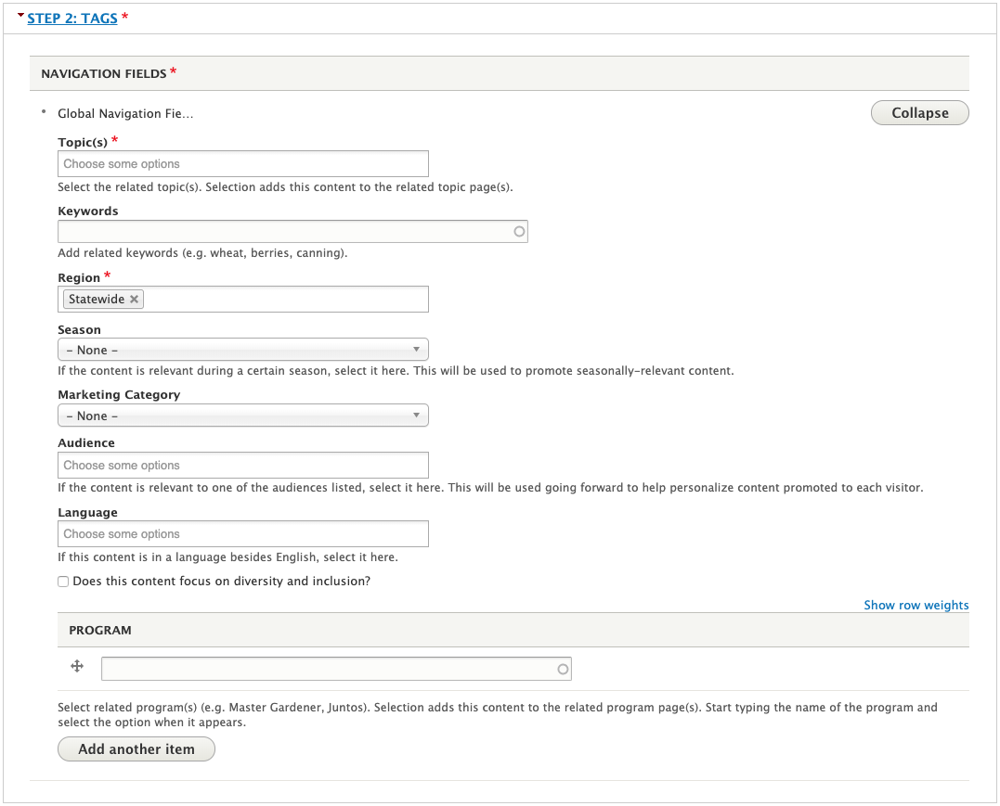

# Article

## What Is an Article

A text-based piece of educational content. This is the preferred way to enter educational content owned by OSU Extension.

Articles stay on the site long-term, so they shouldn’t contain content that is only relevant for a short time. Use newsletter issues or announcements for these instead.

## Who Can Add Articles

Members of Content Team groups.

## Instructions for Articles

To create an Article, go to your My Groups page and select the appropriate *Content Team* group. Then, click the "Create Article" button at the top of the page.

On the edit screen for an article, you will see the following fields:

  - **Previously titled**: if the Article's title has changed, keep track of the old title here. This is to help people who may be searching for the old title.
  - **Content (required)**: the full article content
  - **Show Pesticide Disclaimer**: if the article contains information about pesticides, check the appropriate box to display the standard pesticide disclaimer.
  - **Images**: images that go with the article. These will display in a column on the right-hand side of the article’s text.
  - **Call to Action**: a link displayed at the end of the article to encourage visitors to stay on the site after finishing it. By default, this will display links to the topic page(s) for the topic(s) the article is tagged with. You may want to override this with a link to a program, another piece of content, etc.
  - **Tags (topic required)**: information about the article to help with display, sorting, search, and promotion. See below for more details.
  - **Teaser settings**: here, you can upload a thumbnail that will display in the article's teaser. If the thumbnail is empty, it will use the first image in the "images" field. If the "images" field is empty, it will use a default image based on the topic. There are also a number of description fields that are used for various purposes:
      - **Summary/Description**: This text is displayed in the article's teaser. If it is empty, the teaser will use the first couple sentences of the article itself.
      - **Medium Description**: This text is meant for use when the content is shared on Facebook or other platforms where text length is limited.
      - **Short Description/Deck**: This text is meant for use when the content is shared on Twitter or other platforms where text length is very limited. This text is limited to 280 characters.
  - **Author and Publishing Information**: information about the content for future maintenance.
    - If the content’s author is an OSU Extension employee, start typing their name into the first “Author(s)” field and select them when they come up. This will associate the content with their profile on the site.
    - If the content’s author is not an OSU Extension employee (including OSU employees who don’t have an Extension appointment), enter their information in the “Non-Extension Author(s)” fields.

> **Quick Tip**:
>
>   - Web visitors often scan content on the web to see if it is useful for what they need. Make your article more readable by using these [Accessibility](../content-requirements.md#accessibility) and [writing for the web](../content-requirements.md#writing-for-the-web) tips.
>   - The EESC Publications team will copyedit articles entered in the extension website. See [EESC Copyediting](../managing-content.md#eesc-copyediting) for more information.

## How and Where Articles Display

The tags in the “Tags” section of the edit screen determine where the article displays.

  - **Topic**: It will show in the “Browse All Resources” page for the specified topic(s). A link to the topic page for the topic will display at the end of the article (unless overridden with a custom call to action). Other content tagged with the topic will show at the bottom of the article in a “Related Resources” section.
  - **Program**: If the specified program has added a “Program Tagged Content List” section to one of its pages, it will show up there. See the [Subpage](#subpage) section for more information.
  - The other tags available to fill in are used for internal marketing purposes and/or populating the filters visitors use in search results or on topic pages.

    

Counties and Programs can feature Articles on their pages by selecting them in a page section (for example, a "featured content" section).
