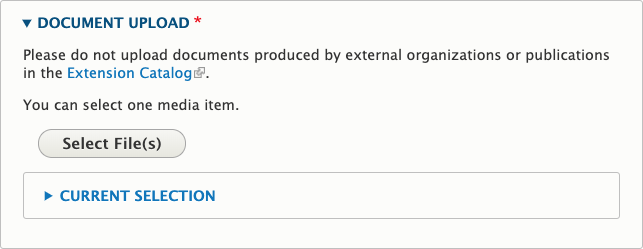

# Educational Document

## What Is an Educational Document

A document (PDF, Word Document, Excel spreadsheet, or PowerPoint presentation) containing educational information.

In almost all cases, educational documents work better as articles. This makes the content more accessible, searchable, and maintainable. Articles can also be saved and printed. Content should only be an educational document if:

  - it is slides from a presentation,
  - it has a lot of complex, in-context graphics or formatting, or
  - it is a fillable or otherwise interactive document.

Educational documents are not appropriate for program forms, event information, driving directions, and other content that is not educational. Instead, these should usually be program resources, events, newsletters, or announcements.

> **Quick Tip**: There are several options available for you to upload files. The best place depends on the audience the document is intended for, whether it will have new versions in the future, and whether it should be private to a certain group. See [File Management](../content-requirements.md#file-management) for more information.

**Catalog publications should not be added as educational documents.** These are added and maintained by EESC.

**Important Note:** Be sure you have permission to share the file before you upload it to the Extension website. See [Copyrighted Content](../content-requirements.md#copyrighted-content).

## Who Can Add Educational Documents

Members of Content Team groups.

## Instructions for Educational Documents

To create an Educational Document, go to your My Groups page and select the appropriate *Content Team* group. Then, click the "Create Educational Document" button at the top of the page.

On the edit screen for an educational document, you will see the following fields:

  - **Document Type**: this will display as a label in the document’s teaser. It helps to provide context to visitors. If empty, “Educational Document” will display.
  - **Document Upload**: upload the document.

    

  - **Short Description**: a summary of the document’s contents that will show in the teaser
  - **Thumbnail**: the image that will show in the teaser. If this is empty and the document is a PDF, it will use an image of the first page of the document. If the document is not a PDF, it will use a default image based on the topic tag.
  - **Tags**: information about the document to help with display, sorting, search, and promotion. See below for more details.
  - **Author and Publishing Information**: information about the content for future maintenance.
    - If the content’s author is an OSU Extension employee, start typing their name into the first “Author(s)” field and select them when they come up. This will associate the content with their profile on the site.
    - If the content’s author is not an OSU Extension employee (including OSU employees who don’t have an Extension appointment), enter their information in the “Non-Extension Author(s)” fields.

## How and Where Educational Documents Display

The tags in the “Topics, Keywords, Programs, and Regions” section of the edit screen determine where the educational document displays.

  - **Topic**: it will show in the “Browse All Resources” page for the specified topic(s)
  - **Program**: If the specified program has added a “Program Tagged Content List” section to one of its pages, it will show up there. See the [Subpage](#subpage) section for more information.
  - The other tags available to fill in are used for internal marketing purposes and/or populating the filters visitors use in search results or on topic pages.

Counties and Programs can feature Educational Documents on their pages by selecting them in a page section (for example, a "featured content" section).
