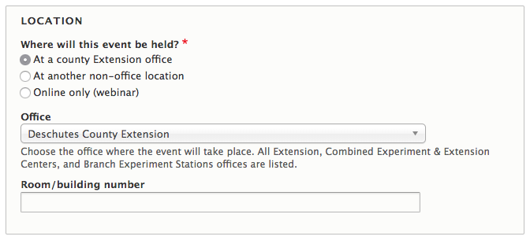

# Event

## What Is an Event

An event that a visitor to the website could attend. This does NOT include office closures, these should be announcements instead.

## Why Create Events

  - Showcase and track the amount of on-the-ground programming that you do.
  - Expand your outreach to local and new audiences about your events.
  - Have a place to direct people for learning more and registering for the event.
  - Can enter once and have it fed to the OSU calendar (and others, such as the [Forestry Extension page](http://extensionweb.forestry.oregonstate.edu/), if relevant).
  - Be able to send specific events to interested people through future digital strategy.
  - Find out which events are most viewed and by what audiences through analytics.

## Who Can Add Events

Any user on the site. If an event applies to more than one county or program, coordinate and make sure to add it only once.

> **Quick Tip**: If an event has been entered that needs to be edited or removed from your page, you should contact the uploader of the event. See [Working with Other Content Authors](../managing-content.md#working-with-other-content-authors).

## Instructions for Events

To create an Event, go to your My Groups page and select the appropriate group (any type). Then, click the "Create Event" button at the top of the page.

On the edit screen for an event, you will see the following fields:

  - **All Day Event**: indicates that an event takes place all day. If checked, you will not need to fill in the time fields for the event date.

  

  - **Event Date (required)**: the date(s) when the event occurs
  - **Event occurs multiple times in the specified period**: check this box if you are entering an ongoing event such as a plant clinic or hotline that has regular hours over the date range you specified. This will reveal a field where you can enter those hours more specifically.

    

  - **Event location fields (required)**:
    - The field asks “Where will this event be held?”
        - If “At a county office,” then select the county office from the drop-down field that appears. The address field will get automatically filled in.
        - If “At another non-office location,” enter the name and address of the location.
            - If the address is not yet known or private, type “To Be Determined” or “To be provided to registrants” in the location name. Then enter the city, state, and ZIP code.
        - If “Online-only,” no address needs to be provided.
          
    - **Room/building number**: include if needed

    <blockquote><strong>Troubleshooting Tip</strong>: If you change an event from an existing location to a custom address, the old location may still show when you save. To correct this:  
      <ol>
        <li>For the field “Where will this event be held?” select “At a county office.”</li>
        <li> Change the drop-down list  to --None-- which unsets the existing location.</li>
        <li>Click the “At another non-office location” button and enter the new address.</li>
        <li>Save.</li>
      </ol>
    </blockquote>

  - **Zoom details**: If you scheduled this event in Zoom, enter the link, phone number(s), and meeting ID provided here (these do not need to be entered in the event description as well).
  - **Event Cost**: how much it costs to attend the event
  - **Registration Link**: a link to register for the event online. If you enter the link here, you don’t need to enter it in the description.
  - **Registration Closed**: If you check this box, the registration button will be replaced with text that says "Registration Closed" on the event page and in teasers for the event in event lists.
  - **Event Type (required)**: the category for the event. This is used for internal reporting as well as for export to OSU's calendar system, Localist.
  - **Description (required)**: the full event description. You do not need to include information, such as date, location, or cost, that is already included in other fields.
  - **More information or promotional flyer**: uploaded flyer or registration form for the event

    

    - Important Note: It is important that any information in a flyer is also included in another field on the event (e.g., in the full description field). This is due to the OSU Calendar import process as well as Accessibility standards. See [Accessibility](../content-requirements.md#accessibility).

  - **Related content**: link to other content on the site related to the event. May include background educational content, other events in a series, or a program resource containing the registration form.
  - **Contact name, email, and phone (required)**: person to contact with questions about the event. This information is required by OSU’s calendar system, which pulls Extension events
  - **Tags**
    - **Topics**: specifies which topic pages the event should show on. Event lists on focus areas set up by counties can also be narrowed to show only events tagged with certain topics.
    - **Additional counties or programs**: other counties and programs where the event should show. You don’t need to include the county or program you are using to enter the event.
    - **Category**: if you are entering an event through a Program group, you can tag it with one of the Program Resource Categories configured for that group (see the Program Resources section for more information). This can be used to narrow event lists on program subpages to only show events in a specific category.
    - **Additional calendar**: used to export events to other calendars and create narrowed-down event lists on program and county pages
  - **Teaser settings**: thumbnail and short description that display in the event's teaser. If the thumbnail is empty, it will use a default image based on the topic, county, or program.

## How and Where Events Display

Event teasers will only display on pages until the event ends. They contain the event title, dates, and the city in which it takes place (or “Online” if it is a webinar). They show on the following pages on the site:

  - Home page: the home page displays a list of the four closest events from every county, program, and content team on the site. Events that occur multiple times over a long period or that are not open to the general public (such as 4-H fair weigh-ins) are excluded.
  - Topic pages: events tagged with the topic in the “Topics, Programs, and Counties” section of the edit screen
  - Program pages: events entered by the program’s group or tagged with the program in the “Topics, Programs and Counties” section of the edit screen.
  - County pages: events entered by the county’s group or tagged with the county in the “Topics, Programs, and Counties” section of the edit screen.
  - County focus areas: Members of a county group can set up event lists on focus area pages that only show a subset of events for that county. These events must be:
    - added through the county group or tagged with that county, and
    - tagged with with either one of some specified topics OR a specified additional calendar.

The FNR Extension website pulls events from the Extension website when “Forestry Extension” is selected under “additional calendars.”
