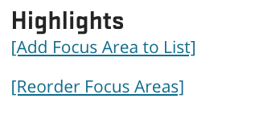
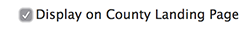

# Local Focus Area

## What Is a Local Focus Area

Information about Extension activities, work, or research done in a county or combined station that relates to a program or topic area. These are intended to act as a link between county pages and topic or program pages. You can highlight content that is especially relevant locally, but try to use topic pages to present educational content.

## Who Can Add Local Focus Areas

Members of County Office groups.

## Instructions for Local Focus Areas

<figure class="video_container">
  <iframe id="kaltura_player" src="https://cdnapisec.kaltura.com/p/391241/sp/39124100/embedIframeJs/uiconf_id/22119142/partner_id/391241?iframeembed=true&playerId=kaltura_player&entry_id=0_zf118eja&flashvars[localizationCode]=en&amp;flashvars[leadWithHTML5]=true&amp;flashvars[sideBarContainer.plugin]=true&amp;flashvars[sideBarContainer.position]=left&amp;flashvars[sideBarContainer.clickToClose]=true&amp;flashvars[chapters.plugin]=true&amp;flashvars[chapters.layout]=vertical&amp;flashvars[chapters.thumbnailRotator]=false&amp;flashvars[streamSelector.plugin]=true&amp;flashvars[EmbedPlayer.SpinnerTarget]=videoHolder&amp;flashvars[dualScreen.plugin]=true&amp;&wid=0_pu0vws88" width="554" height="366" allowfullscreen webkitallowfullscreen mozAllowFullScreen allow="fullscreen*; encrypted-media*" frameborder="0" title="Kaltura Player"></iframe>
</figure>

To create a Local Focus Area, go to your My Groups page and select the appropriate *County Office* group. Then, click the "Create Local Focus Area" button at the top of the page.

On the edit screen for a focus area, you will see the following fields:

  - **Display on county landing page**: three focus area teasers display on each county landing page. Ones that have this box checked show up first.
  - **How to display (required)**: you have three options:
    1. **Link to a local program**: this will allow you to select a local program (MG or 4-H). When visitors click on the focus area, they will go directly to the existing landing page for that local program.
    2. **Link to an existing focus area in another county**: if you would like to share a focus area with another county (e.g. for a regional focus area), select it here. When visitors click on the focus area, they will go directly to the existing focus area.
    3. **Display a custom page**: this creates a new page for the focus area. The following fields are available for this page:
        - **Hero image**: large image that displays at the top of the page.
        - **Introduction**: text at the top of the page to introduce the focus area.
        - **Summary/about**: an additional text area (with a full-screen background image) for more information about the focus area.
        - **Page sections**: additional content for the page. See the [Page Sections](../using-site.md#page-sections) section of this guide for more information. The following types of sections are available:
            - **Call to action**: link to content or an external website with a custom title, description, and image.
            - **County events list**: list of events entered by or tagged by the county. You can narrow the events shown by either the topic(s) or "additional calendar" the events are tagged with.
            - **Custom content list**: One or more pieces of content with a custom section title and description. The first three items selected will show as teasers with thumbnails. The remaining selected items will display in a simpler text-only list.
            - **Highlighted content item**: a piece of content with a custom description and full-width background image.
            - **Image slider**: a slideshow of uploaded images.
            - **Quick links bar**: a full-width bar that contains up to four highlighted links (e.g. to Facebook, Twitter, a newsletter, or a calendar). This is meant to provide quick access to the most important things provided on the page.
            - **Video**: a video from YouTube, Vimeo, or OSU Media Space.
        - **Featured users**: specify the faculty/staff in the county who work in this focus area.
        - **Contact information**: if the focus area has specific contact info that is different than the main county, enter it here.

  - **Tags**
    - **Topic**: the topic(s) the focus area relates to. Selecting a topic here will cause a link to it to appear at the bottom of the focus area's page. It will also create a link to the Focus area on the topic's "In Your Community" page.
    - **Program area (required)**: the program area the focus area relates to. This is used for internal organization and reporting only.
    - **Marketing category**: which of the Extension marketing categories the focus area relates to. This is used for internal organization and reporting only. It may also help coordinate content between county pages and county pull sheets and other marketing materials.
  - **Teaser settings (short description required)**: thumbnail and short description that display in the focus area's teaser. If the thumbnail is empty, it will use a default image based on the topic. You can also select a local program to link to in the Focus area's teaser. This will be separate from the main focus area link, which will continue to work as configured above.

## How and Where Local Focus Areas Display

All focus areas entered by a county group will show up on an automatically-generated "What We Do" page for the county. To reorder the focus areas, click the "Reorder Focus Areas" link above the list.

*Example of a how to Reorder Focus Areas*

Five focus areas will display on the county landing page with a button to see the full list. You can control which focus areas show up here using the "Display on County Landing page" checkbox on the focus areas.

