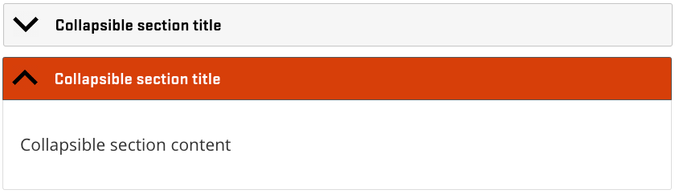
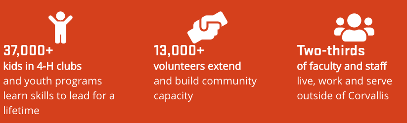

# Subpage

## What Is a Subpage

A customizable page for organizing content and providing additional context or information about a program.

> **Quick Tip**: Web visitors often scan content on the web to see if it is useful for what they need. Make your page’s content more readable by using these [Accessibility](../content-requirements.md#accessibility) and [writing for the web](../content-requirements.md#writing-for-the-web) tips.

## Who Can Add Subpages

Members of program groups.

## Instructions for Subpages

<figure class="video_container">
  <iframe id="kaltura_player" src="https://cdnapisec.kaltura.com/p/391241/sp/39124100/embedIframeJs/uiconf_id/22119142/partner_id/391241?iframeembed=true&playerId=kaltura_player&entry_id=0_gqibbuq0&flashvars[localizationCode]=en&amp;flashvars[leadWithHTML5]=true&amp;flashvars[sideBarContainer.plugin]=true&amp;flashvars[sideBarContainer.position]=left&amp;flashvars[sideBarContainer.clickToClose]=true&amp;flashvars[chapters.plugin]=true&amp;flashvars[chapters.layout]=vertical&amp;flashvars[chapters.thumbnailRotator]=false&amp;flashvars[streamSelector.plugin]=true&amp;flashvars[EmbedPlayer.SpinnerTarget]=videoHolder&amp;flashvars[dualScreen.plugin]=true&amp;&wid=0_7l0j1tox" width="554" height="366" allowfullscreen webkitallowfullscreen mozAllowFullScreen allow="fullscreen*; encrypted-media*" frameborder="0" title="Kaltura Player"></iframe>
</figure>

To create a subpage, go to your My Groups page and select the *Program* group. Then, click the "Create Subpage" button at the top of the page.

The edit screen for a subpage contains fields for the page title, hero image, and some basic text content. The hero image displays as a banner at the top of the page, so it should be about 2000px wide by 400px high. If this is empty, it will use the hero image of the county or program in its group.

There is also a section for "teaser settings" where you can define a short description and thumbnail to display in search results and teasers that list the subpage.

Content for subpages is primarily added through page sections (see [Page Sections](../using-site.md#page-sections) for more information). These types of sections are available

  - **Button Link**: a link to another page (in or outside of the Extension site) styled as a large orange button
  - **Call to Action**: a link to another page (in or outside of the Extension site) that includes a description and image
  - **Collapsible Section**: text that can be collapsed and expanded

    
  
  - **Featured Content**: links to content in the Extension site
  - **Image**: an image with optional caption and alternative text to describe the photo
  - **Image slider**: a slideshow of uploaded images
  - **Impact stats bar**: a stylized orange bar containing three items intended to highlight statistics about the program's impact.
    
  - **Program Contact Information**: displays the location, phone number, and email entered in the "Program Info" section of the edit screen for the program
  - **Program Events List**: shows a list of events that have either been added to the program or tagged with the program by another group. You can narrow events shown in a particular list by the "Program Resource Category" they are tagged with.
  - **Program Faculty/Staff List**: shows a list of users who are tagged as being part of the program
  - **Program Resources List**: a list of program resources associated with the program.
    - When you add this section, you can specify one or more “Category to display.” Only resources tagged with all specified categories will show in the section.
    - If there are no program resources with the specified category, the program resource list will not show up and the “title” and “description” will stay invisible to the public. If you want the description text to be visible on the Subpage regardless, it’s best to use a “Text” section instead.
    - By default, resources are sorted alphabetically. You can reorder the resources in a list by hovering over the list, clicking the pencil icon that appears to the right of the title, and selecting “Reorder items.” This will take you to a page where you can drag and drop the resources into the order you want. Click save and you will go back to the page you were on.

      

    - You will not see the resources pulled in to the section until you click “Save” and view the page.

  - **Program Social Media List**: shows a list of all social media links entered by the program
  - **Program Statewide Resources**: a list of program resources associated with the local program’s statewide “parent.” This is currently applicable only to 4-H and Master Gardener.
  - **Program Tagged Content List**: an automatically generated list of content in the site that has been tagged with the program.
  - **Quick links bar**: an orange bar across the page that can contain links to social media or important pages
  - **Statewide Program Events List**: shows a list of events that have been entered by a local program’s statewide “parent.”
  - **Tabbed Section**: allows you to display other sections in tabs, where only one tab is displayed at a time and visitors can switch between them
  - **Text**: a simple text box with formatting such as bold or italic
  - **Text with background**: a text section with a background image that stretches all the way across the page. This image should be at least 2000px wide.
  - **Two-Column Section**: allows you to display other sections in two columns instead of one (on large enough screens)
  - **Three-Column Section**: allows you to display other sections in three columns instead of one (on large enough screens)
  - **Video**: an embedded video from YouTube, Vimeo, or OSU Media Space

> **Quick Tip**: For help featuring educational content entered by Content Teams on their pages, see: [Organizing and Displaying Content on Other Pages](../managing-content.md#displaying-and-organizing-content-on-other-pages).

## Where and How Subpages Display

Subpages display in program sidebars. You can reorder subpages in the sidebar by clicking the “Reorder Pages” button at the bottom of the sidebar.

This will take you to a page containing a list of pages in the sidebar.

Use the arrow controls next to each page to drag them into the order you want. When you’re finished, click the “Save Order” button at the bottom of the page.

To nest one or more pages under another, drag the nested page to the right and you’ll see it slightly indented. You can do this for as many menu pages as you would like, but only one level down. If you want a page to no longer be nested, drag it back to the left.

Note that sidebars contain some automatically generated pages at the top, above the listed subpages, that cannot be reordered.

You can add links to external sites, such as a college or association site, to the bottom of the sidebar. To do this, edit the program or county the sidebar belongs to. Open the “Sidebar” tab on the edit screen and click the “Add Button Link” button.
