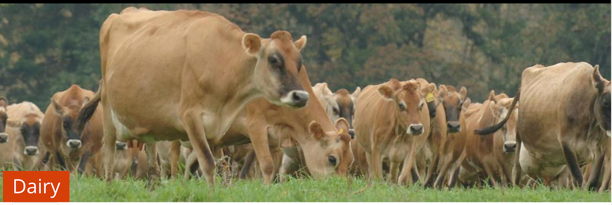
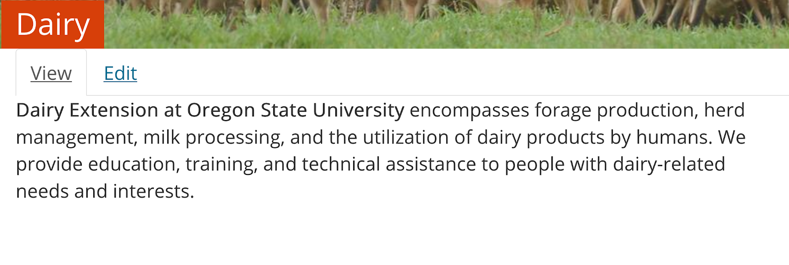
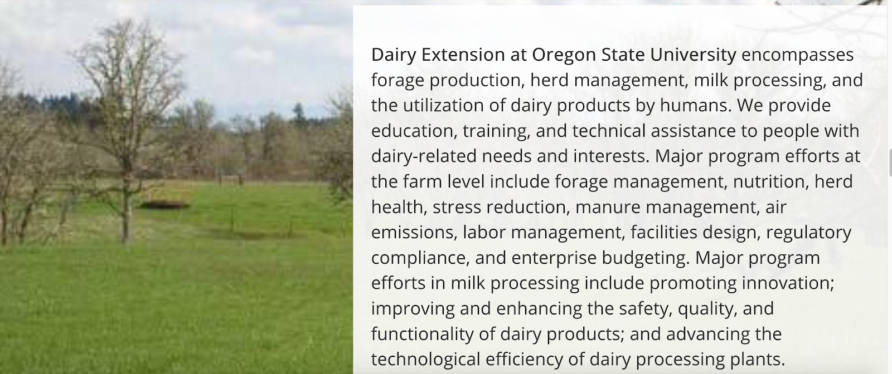
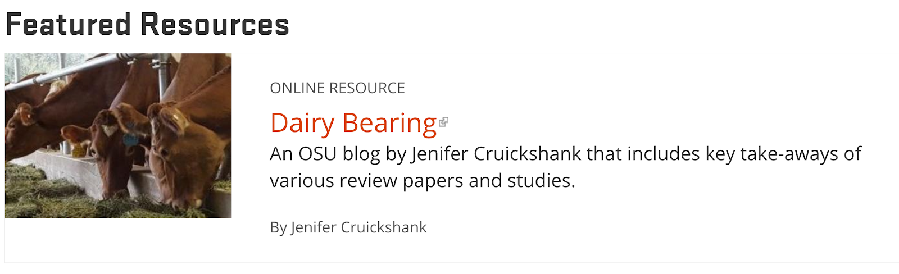

# Topic Page

## What Is a Topic Page

A “topic page” actually consists of several pages, which are listed in a menu across the top of the landing page:

  - **Landing Page (“home” for the topic)**: the first page visitors see when they click on a topic. Here is a list of what this page itself consists of (items marked with a “\*” are customizable by topic committees):
    - **Hero image\***: large image across the top of the page
    - **Short description\***: one or two sentences about the topic and the work Extension does relating to it
    - **Resource lists\***: can be configured as needed
    - **About section\***: more in-depth information about the topic and Extension’s work, optionally with a large background image
    - **Explore more resources\***: links to other topic pages that contain content that may be of interest to visitors
    - **Upcoming events**: the three closest upcoming events tagged with the topic
    - **Meet our experts\***: if experts are selected by the topic committee, they will display here. Otherwise, the first four people with their “Expertise” set to the topic will display in alphabetical order
    - **Ask an Expert**: for people to submit questions
  - **Browse Resources**: all content in the site tagged with the topic
  - **Events**: all upcoming events tagged with the topic
  - **Get Involved**: all programs tagged with the topic
  - **Our Work**: all projects tagged with the topic
  - **Our Experts**: all users with their Expertise set to the topic

If there isn’t any content on a page, the link won’t appear in the menu.

> **Quick Tip**: For guidelines to help decide what content to feature on a Topic Page, [Planning and Evaluating Content](../content-requirements.md#planning-and-evaluating-content).

## Who Can Add Topic Pages

Topics are set up by the EESC web team. No one can add or delete a topic, but topic committee members are able to edit certain sections of the landing page. If you have content that doesn’t fit into an existing topic, you can request a new one for consideration. The following criteria are used to determine whether something should be a topic on the site:

  - There is a reasonable amount of content for the topic
  - At least one content team is associated with the topic
  - User feedback or other data supports the need for the topic
  - The topic has a user-friendly label, meaning:
    - it is appropriate for its audience (e.g., if the content is generally targeted or industry targeted), and
    - there evidence that web visitors understand and use the term.
  - Other Content Teams that have entered or would enter content for the topic have been consulted and are willing to help with retagging content from their group.

You can request a new topic by submitting a [support request](https://osueesc.atlassian.net/servicedesk/customer/portal/2).

The educational content that shows on topic pages is entered by content teams. A single topic page may showcase content from multiple content teams, and a single content team may enter content for multiple topics. Topic Committee groups are responsible for featuring content on topic pages. See [Getting Started with Content - Topic Committees](../getting-started.md#topic-committees) for more information.

## Instructions for Topic Pages

<figure class="video_container">
  <iframe id="kaltura_player" src="https://cdnapisec.kaltura.com/p/391241/sp/39124100/embedIframeJs/uiconf_id/22119142/partner_id/391241?iframeembed=true&playerId=kaltura_player&entry_id=0_pdyu7cve&flashvars[localizationCode]=en&amp;flashvars[leadWithHTML5]=true&amp;flashvars[sideBarContainer.plugin]=true&amp;flashvars[sideBarContainer.position]=left&amp;flashvars[sideBarContainer.clickToClose]=true&amp;flashvars[chapters.plugin]=true&amp;flashvars[chapters.layout]=vertical&amp;flashvars[chapters.thumbnailRotator]=false&amp;flashvars[streamSelector.plugin]=true&amp;flashvars[EmbedPlayer.SpinnerTarget]=videoHolder&amp;flashvars[dualScreen.plugin]=true&amp;&wid=0_4uq12pex" width="554" height="366" allowfullscreen webkitallowfullscreen mozAllowFullScreen allow="fullscreen*; encrypted-media*" frameborder="0" title="Kaltura Player"></iframe>
</figure>

On the edit screen for a topic landing page, you will see the following fields:

  - **Hero image**: the large image across the top of the page. Please use an image that is at least 2000px wide and 325px tall. When uploading an image, please be sure to set the “**focal point**” so it will display properly on all screen sizes.

    

  - **Description**: the short block of text that appears at the top of the page. Limit this to one or two sentences.

    

  - **Related Topics**: creates links on the topic landing page to other topics.

    

  - **About Section**: Click the “Add Text with Background” button to enter a longer description of the topic and an image to use as a background. Please use an image at least 2000px wide and tall enough to be a backdrop to the text you write. Remember to set the focal point when uploading it.

    

  - **Landing page sections**: You can add two different types of sections to the page:
    - **Call to Action**: a link to another page (in or outside of the Extension site) that includes a description and image
    - **Custom topic section**: a section title (e.g., “Featured Resources”), several pieces of manually selected content, and a manually entered link to see more content. A good option here is to use a link to the topic’s “Browse Resources” page with one or more filters already applied. Examples may be specific subtopics such as “Nutrients” or audiences such as “Coastal Region.” More than one Custom topic section can be added to highlight frequently looked for categories.
    - **Latest topic content**: the newest three pieces of content tagged with the topic. It can be narrowed by content type to, for example, show only the newest three videos or Extension Catalog publications. More than one of these sections can be added.

      
      
      
    - **Text with background**: a text section with a background image that stretches all the way across the page. This image should be at least 2000px wide.
    - **Two-Column Section**: allows you to display other sections in two columns instead of one (on large enough screens)

  - **Featured experts**: Enter the ONID usernames (not full names) of the people to show in the “Meet Our Experts” section. If none are selected, the first four people in alphabetical order with their “Expertise” set to the topic will show up.

    

## How and Where Topic Pages Display

The black menu bar at the top of every page contains a list of all topics. There are also links to all top-level topics on the home page.

We encourage counties to link to topics that are especially relevant to visitors from their county. This can be done via a “Button Link” or “Call to Action” section.
