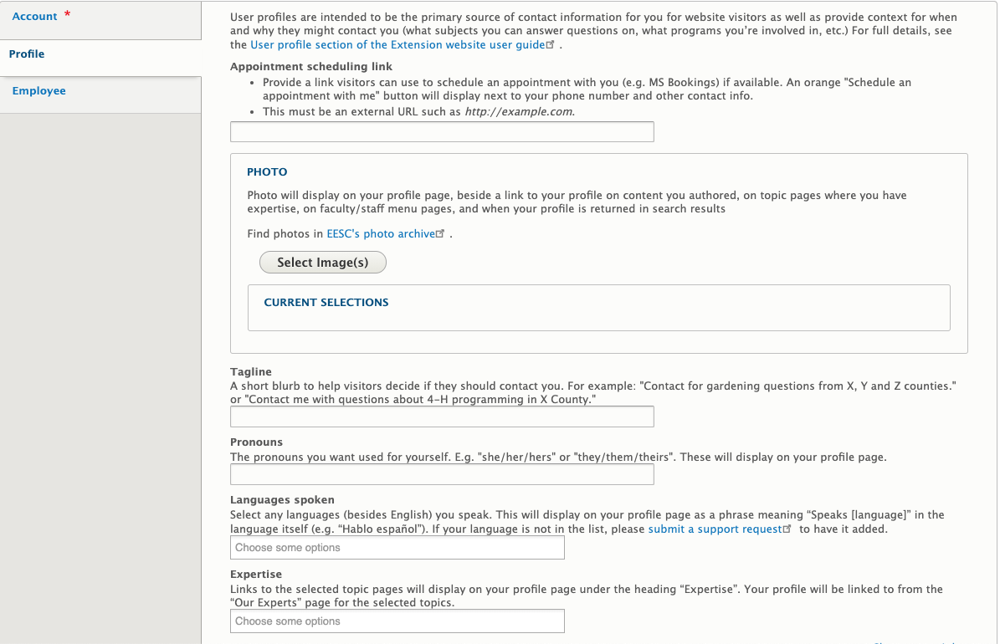
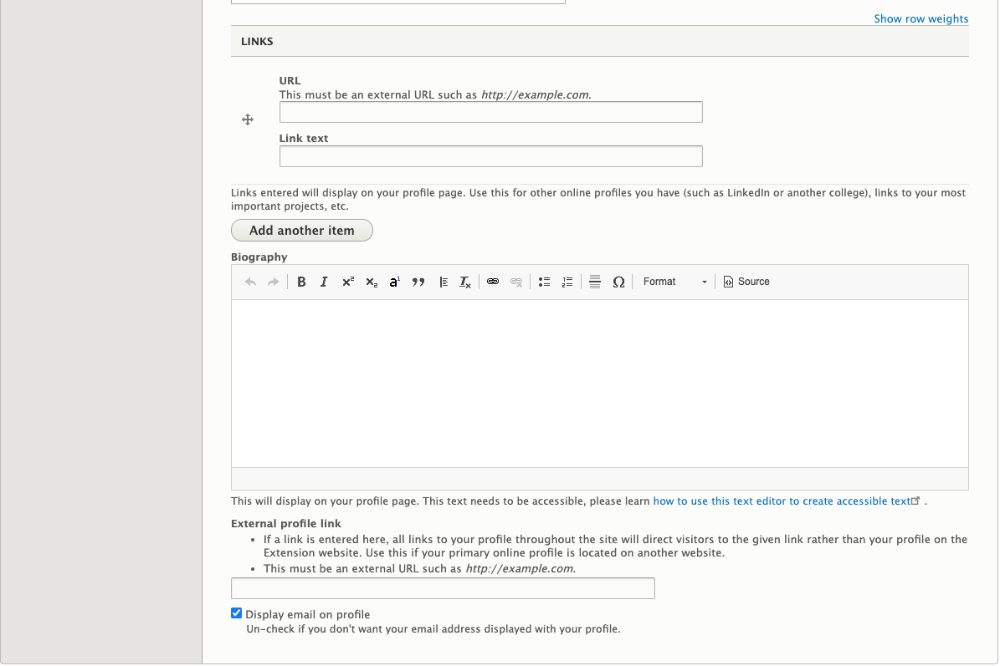

# User Profile

## What Is a User Profile

Information about a person. This includes contact information and information about the work they do.

## Who Can Add User Profiles

All users on the Extension website are able to edit certain parts of their profile. This includes users who are not a member of any groups.

## Instructions for User Profiles

<figure class="video_container">
  <iframe id="kaltura_player" src="https://cdnapisec.kaltura.com/p/391241/sp/39124100/embedIframeJs/uiconf_id/22119142/partner_id/391241?iframeembed=true&playerId=kaltura_player&entry_id=1_n6e8u834&flashvars[localizationCode]=en&amp;flashvars[leadWithHTML5]=true&amp;flashvars[sideBarContainer.plugin]=true&amp;flashvars[sideBarContainer.position]=left&amp;flashvars[sideBarContainer.clickToClose]=true&amp;flashvars[chapters.plugin]=true&amp;flashvars[chapters.layout]=vertical&amp;flashvars[chapters.thumbnailRotator]=false&amp;flashvars[streamSelector.plugin]=true&amp;flashvars[EmbedPlayer.SpinnerTarget]=videoHolder&amp;flashvars[dualScreen.plugin]=true&amp;&wid=0_9g2z999q" width="554" height="366" allowfullscreen webkitallowfullscreen mozAllowFullScreen allow="fullscreen*; encrypted-media*" frameborder="0" title="Kaltura Player"></iframe>
</figure>

To get to the edit screen for your profile, click on the “My Account” link in the footer of any page:

Then, click on the “Edit” tab at the top of your profile. The fields you are able to edit are in the “Profile” tab on the left-hand side of the edit screen.

On the edit screen for your profile, you will see the following fields:

  - **Appointment scheduling link**: Provide a link visitors can use to schedule an appointment with you (e.g. MS Bookings) if available. An orange "Schedule an appointment with me" button will display next to your phone number and other contact info.
  - **Photo**: a photo of yourself.
  - **Tagline**: a sentence or two that displays alongside links to your profile. Use this to describe why website visitors would want to contact you, remembering that it may display in many different contexts on the website (in faculty/staff directories, on articles you author, etc.).
  - **Pronouns**: Specify your pronouns. Read more about [why pronouns matter](https://lgbt.ucsf.edu/pronounsmatter).
  - **Languages spoken**: Selecting a language here will display a sentence in the language on your profile letting visitors know that you speak it (e.g. "Hablo español" for Spanish). If a language you speak is not included in the list of options, please [submit a support request](https://osueesc.atlassian.net/servicedesk/customer/portal/2) so it can be added.
  - **Expertise**: the topic(s) in which you work. Selecting a topic here will list you as an “Expert” on that topic page. Feel free to list expertises that are not in the topic list in your Biography field.
  - **Links**: You can link to other websites with information about you, such as a LinkedIn account.
  - **Biography**: information about yourself and your work, including links or lists of publications.
  - **External profile link**: If you have a profile on another college website, you can link to it here. Visitors who click on you will go there directly.
  - **Display email on profile**: Uncheck if you don't want your email address displayed with your profile. The contact form will remain available on your profile page for people to email you.

For changes to other information, please submit a [support request](https://osueesc.atlassian.net/servicedesk/customer/portal/2).

## Where and How User Profiles Display

The black menu bar at the top of every page contains a link to the [faculty and staff directory](https://extension.oregonstate.edu/people/directory). This is a list of all people in Extension. There are also narrowed-down directories on program, county, and topic pages. These depend on the tags given to the user. People can also be found by typing their name in the Search field at the top of every page.

User profiles display some basic information about the person at the top, including their photo, pronouns (if specified), and job title. Other information is displayed in tabs at the bottom of the page:

  - Contact: displays the person's office location and phone number(s) as well as a contact form to email them.
  - About: displays the person's biography, if they have entered one.
  - Content: displays a list of content entered in the site that was authored by the person and tagged as such.
  - Publications: displays a report of the publications the person has entered in their Digital Measures profile. If the person doesn't have a Digital Measures profile or the report is empty, this tab will not display. You can control what items show up in this report from Digital Measures. [Learn more about Digital Measures web profiles](https://digitalmeasures.oregonstate.edu/training/web-profiles).
  - Awards: displays a report of the awards the person has entered in their Digital Measures profile. If the person doesn't have a Digital Measures profile or the report is empty, this tab will not display. You can control what items show up in this report from Digital Measures. [Learn more about Digital Measures web profiles](https://digitalmeasures.oregonstate.edu/training/web-profiles).
