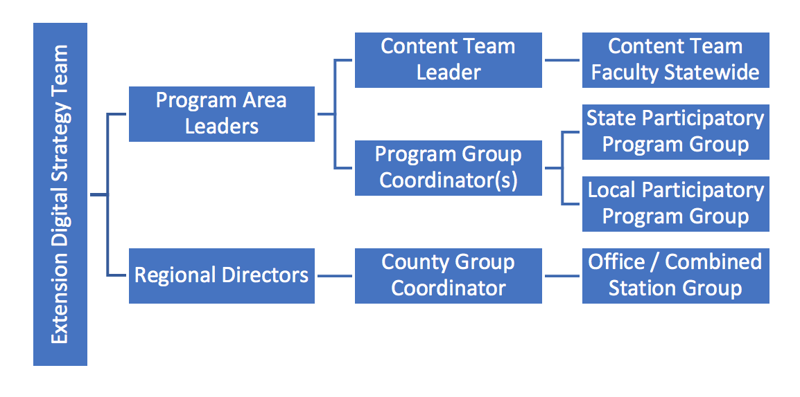

# Getting Started with Content

When you have content that you want to put online, you first need to figure out where it belongs. Your groups determine what content you can enter and edit in the Extension website.

## Options on Where to Put the Content

**All content that is going to be included in Extension’s digital strategy going forward must be entered in the Extension website.** This includes most, but not all, of Extension’s existing web content.

However, the Extension website is *not* a good place for:

  - Extension faculty and staff resources
  - Historical documents or reference materials. Use Box or archive as appropriate.
  - Content that needs work. Content should conform to the website’s guiding principles, described in the introduction to this guide. Before adding content to the new site, review and/or revise to ensure accuracy. Revise or redesign to ensure it is on brand.
  - Volunteer resources. A separate website solution is being discussed. For now, a combination of the Extension website and Box is a likely solution. When your team is ready to add volunteer content, please let us know. Together, we can decide on the best short-term solution.

There are several options for content that doesn't go on the Extension website. See [Getting Help](getting-help.md) if you need help choosing the best method for your content.

**Solution** | **Good For** | **Not Good For** | **Notes**
-------------|--------------|------------------|----------
**Employee Intranet** | Content for Extension employees | Content for a small audience (for example, workgroups, committees); files that need to be password protected |
**Extension ConnEXTions** | News or timely information for Extension employees | Urgent communications; resources that will be used long-term |
**Box** | Documents for smaller groups; documents that need to be password protected | | Members of the public don’t need an ONID to access files in Box. You can specify any password you like for them to use or none at all.
**Webforms (Qualtrics, Google Forms)** | Forms and surveys that collect non-sensitive data | Collecting sensitive data; large event management or online class enrollment | Consider partnering with PACE for larger registration needs.
**OSU WordPress Blog** | Content that isn’t for a broad number of external visitors | Anything that should be included in the digital strategy going forward; content for a general external audience |
**Scholars Archive** | Historical documents and research | | EESC is responsible for archiving Extension catalog publications.
**Library Archive** | Websites that are historical (no longer maintained) | |

## Drupal Groups

Your groups assigned in the Drupal content management system (CMS) determine what content you are allowed to edit. When someone in your a group creates a piece of content, you and anyone in your that group can edit it. If someone adds content in a group you are not a member of, you can’t edit it. Similarly, a person can’t edit content that belongs to a group they are not part of.

When you are a member of a group, the *type* of group determines what *type* of content you can add. There are four types of groups on the site.

  - Content Team
  - Program Team
  - County Office Team
  - Topic Committee (representatives from different content teams)

A person may be a member of several groups with different group types, so it is important to understand what content belongs in what group.

## Roles and Responsibilities

It is helpful in knowing not only your Drupal groups, but the roles of all the people involved in the OSU Extension digital content and engagement strategy. This can show you where to get support. Current responsibilities have focused on the Extension website, although it is just a piece of the long-range plans.

**Everyone in Extension**

  - Engage with and contribute to at least one content team or program or office group
  - Ensure your web profile is updated, add a headshot photo, and select expertise
  - Provide information requested to begin development of the customer relationship management system

**Program Area Leaders and Regional Directors**

  - Establish process and calendar for creation/management of content
  - Help the DCE team establish metrics necessary to maintain progress and align with current OSU Strategic Plan
  - Work with content strategist to establish governance plans
  - Ensure supervised faculty are engaged and actively participating in at least one content team
  - Begin planning for use of customer relationship management system to meet specific program goals

**Team or Group Leaders**

  - Establish team or group role assignments
  - Review website changes, content updates, and new features as they are rolled out and communicate to team or group members
  - Establish a content plan with the support of the content strategist
  - Coordinate who will do entry in the team or group and establish a process
  - Ensure faculty and staff on related Extension website pages are up to date

**Team or Group Members**

- Contribute to your team&#39;s content plan or group&#39;s assignments
- Add missing, relevant content to the website
- Increase findability of content by monitoring and revising tags
- Improve readability and review accuracy of existing content

Learn more about these [Primary Roles and Responsibilities](primary-roles.md)

The executive leadership and communication and technology units also have a role to play. Their responsibilities look at project management, resource alignment, communication and training, systems development and integration, and other strategic planning roles.

Learn more about the Other Roles and Responsibilities for [Leadership](leadership-roles.md) and [Support](support-roles.md)

### Content Teams

Content teams are responsible for *entering educational content, including region specific content*. They can also add events and newsletters if not already added by another team.

Content entered by Content Teams primarily displays on topic pages on the Extension website (e.g. the Dairy topic page). A single content team may enter content for multiple topics. Likewise, a single topic page may show content entered by multiple groups.

### Program Groups

Program groups are responsible for *entering materials that visitors need to join or participate in their program (e.g. Master Woodland Managers)*.

On the Extension website, they can also feature educational content entered by a Content Team that is especially relevant to members of their program or point people to the relevant topic pages.

Program groups do not represent the seven Extension program areas, institutes, centers, nor industry/discipline programs. They are ways for the public to get involved in programming like Master Beekeeper or Walk with Ease.

For most programs, a single statewide group enters content (e.g. Better Bones and Balance). However, programs that differ significantly by county may have a separate group for each of their local programs (e.g. Benton County 4-H). This also requires having enough county-based staff to support content maintenance.  

Program teams will enter most of their content as “program resources”. Each of these represents an individual form, file, or link. They can organize these on “subpages” on the Extension website. Program groups can also enter events, newsletters, and announcements that are of interest to members of their program.

### County Office Groups

County office groups are responsible for *entering content about their office’s physical location and services provided, highlighting the activities going on at the office, and directing visitors to relevant educational and program content*. This also includes the combined stations.

County office groups can create events and newsletters. They can also set up local focus areas on the Extension website. These serve as a link between the county and a topic or program that is of particular interest to visitors from that county. For example, a county on the coast could describe their work with coastal issues and link to educational content about marine wildlife. Combined stations will also be linked to the research pages on the College of Agricultural Sciences website for agricultural experiment and combined stations.

### Topic Committees

Topic Committees are responsible for deciding what content to feature on the topic page they are in charge of (e.g. Beef Cattle). This may involve:

  - identifying the various audiences the topic is aimed at and their questions
  - highlighting high quality, important, or seasonally relevant content for that topic
  - setting up keyword standards for content in that topic
  - establishing a content schedule for the topic page content

They may also write some text for topic pages that describes Extension’s work in a particular area. As a committee, they do not enter pieces of content themselves.

Most members of topic committees will also be members of a content team. However, it is not necessary to be on a content team (or any other group) to be on a topic committee.

*Types of groups and how they overlap.*

#### Case Study: Groups for a Master Gardener Coordinator

Say that in county X, there is a single person that acts as a Master Gardener volunteer coordinator. This employee develops educational materials as well as forms and other materials for volunteers.

This person would be a member of (at least) two groups.

  1. The “Home Horticulture” content team: They would use this group to enter their educational gardening content, since gardening information is relevant to people outside the program too, not just participants.
  2. The “Master Gardener – X County” program team: They would use this group to enter the program materials for Master Gardeners in their county. They could also display educational content that their volunteers would find useful.

  ## Roles and Responsibilities

  It is helpful in knowing not only your Drupal groups, but the roles of all the people involved in the OSU Extension digital content and engagement strategy. This can show you where to get support. Current responsibilities have focused on the Extension website, although it is just a piece of the long-range plans.

  **Everyone in Extension**

  -
    - Engage with and contribute to at least one content team or program or office group
    - Ensure your web profile is updated, add a headshot photo, and select expertise
    - Provide information requested to begin development of the customer relationship management system

  **Program Area Leaders and Regional Directors**

  -
    - Establish process and calendar for creation/management of content
    - Help the DCE team establish metrics necessary to maintain progress and align with current OSU Strategic Plan
    - Work with content strategist to establish governance plans
    - Ensure supervised faculty are engaged and actively participating in at least one content team
    - Begin planning for use of customer relationship management system to meet specific program goals

  **Team or Group Leaders**

  -
    - Establish team or group role assignments
    - Review website changes, content updates, and new features as they are rolled out and communicate to team or group members
    - Establish a content plan with the support of the content strategist
    - Coordinate who will do entry in the team or group and establish a process
    - Ensure faculty and staff on related Extension website pages are up to date

  **Team or Group Members**

  - Contribute to your team&#39;s content plan or group&#39;s assignments
  - Add missing, relevant content to the website
  - Increase findability of content by monitoring and revising tags
  - Improve readability and review accuracy of existing content

  Learn more about these Primary Roles and Responsibilities [make this linked to a nested subpage].

  The executive leadership and communication and technology units also have a role to play. Their responsibilities look at project management, resource alignment, communication and training, systems development and integration, and other strategic planning roles.

  Learn more about the Other Roles and Responsibilities for leadership and support [make this link to nested subpages with leadership and support roles]

## Content Types

As mentioned in the introduction to this guide, it is important that content have structure for Extension’s digital strategy to work. A **content type** is how we structure a piece of content. Examples on the Extension website are articles, events, newsletters, and videos. Each content type has different fields to fill out when entering it.

The content types that you are able to use depend on the group type you are using.

**Web  Groups** | **Content  Teams** | **Program  Groups** | **MG & 4-H County  Program Groups** | **County  Offices**
-------|:-------:|:-------:|:-------:|:-------:
**Announcement**  County and program news items or announcements | | x | x | x
**Article**  Text and image-based educational content | x | | |
**Collection**  Manually selected groups of educational content | x | | |
**Educational Document**  General-interest educational material uploaded as a document | x | | |
**Event**  Workshops, classes, event information for external audience | x | x | x | x
**Local Focus Area**  Description of work done in a county in a particular topic or program | | | | x
**Newsletter Issue**  Print, electronic, web-based newsletters | 
x
 | x | x | x
**Online Resource**  Link to educational material located on another website | x | | |
**Program Resource**  Materials only of interest to people involved in a program. May be an uploaded document or a link to an external site | | x | x |
**Project**  An activity done by Extension with outputs or impacts of interest to the public. May include tools, background research, progress updates, etc. | x | | |
**Project Supporting Material**  Content providing context or additional information about a project | x | | |
**Social Media Link**  Link to a social media account for county or program. | | x | x | x
**Subpage**  Information about county location or program involvement. May also group or link to educational content relevant to a specific audience | | x | x | x
**Video**  An informational video | x | | |

### Shared Content Types

These content types can be added by a number of group types.

  - **Announcement**: a time-sensitive piece of information
  - **Event**: an event that people can attend
  - **Newsletter Issue**: a newsletter. This can also include content that comes out sequentially and that we would like to keep a record of, such as pest alerts or research updates.
  - **Social Media Link**: a link to a social media account for an Extension program or county office.

### Content Team Content Types

  - **Article**: text-based educational content
  - **Collection**: a group of other pieces of content of any content type
  - **Educational Document**: a file (such as a PDF or Excel spreadsheet) containing educational content that cannot be entered as an article, including calculators, diagrams, or other content that depends on images or formatting
  - **Project**: information about a partnership, project, or activity done by Extension
  - **Online Resource**: a link to an external website containing educational content
  - **Video**: an educational video

### Program Team Content Types

  - **Program**: Represents an externally facing Extension program that members of the public can participate in. (See the [Adding and Editing Content - Program](adding-editing.md#program) section for more information about what a “program” is.)
  - **Program Resource**: A file or link to a resource needed for visitors to join or participate in a program.
  - **Subpage**: A page to organize program resources and supply supplementary text, images, and videos.

### County Office Team Content Types

  - **County office**: Represents an Extension presence in a county.
  - **Local focus area**: Information about work or activities done in a county that relate to a program or topic.
