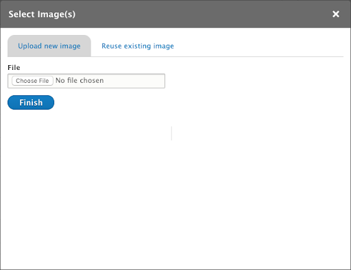
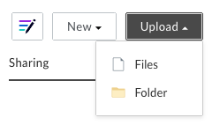
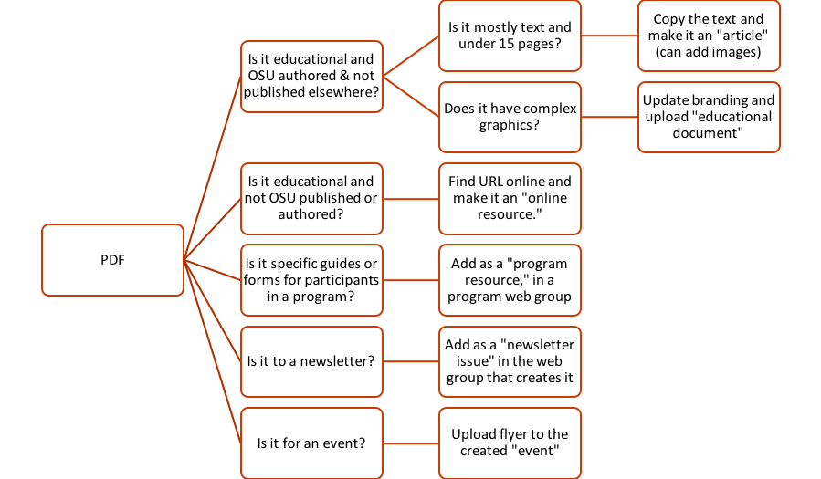

# Images, Documents and Media

## Using Images

<figure class="video_container">
  <iframe id="kaltura_player" src="https://cdnapisec.kaltura.com/p/391241/sp/39124100/embedIframeJs/uiconf_id/22119142/partner_id/391241?iframeembed=true&playerId=kaltura_player&entry_id=1_gmdtmh57&flashvars[localizationCode]=en&amp;flashvars[leadWithHTML5]=true&amp;flashvars[sideBarContainer.plugin]=true&amp;flashvars[sideBarContainer.position]=left&amp;flashvars[sideBarContainer.clickToClose]=true&amp;flashvars[chapters.plugin]=true&amp;flashvars[chapters.layout]=vertical&amp;flashvars[chapters.thumbnailRotator]=false&amp;flashvars[streamSelector.plugin]=true&amp;flashvars[EmbedPlayer.SpinnerTarget]=videoHolder&amp;flashvars[dualScreen.plugin]=true&amp;&wid=0_icon48zh" width="554" height="366" allowfullscreen webkitallowfullscreen mozAllowFullScreen allow="fullscreen*; encrypted-media*" frameborder="0" title="Kaltura Player"></iframe>
</figure>

### Image, Document, Audio, and Video Browsers

For fields that allow you to upload an image or document or embed audio or a video, you will see a button that says “Select Image”, “Select Document”, “Select Audio”, or "Select Video" (i.e, when uploading an image, it will say “Select image”). Clicking this button will open a new window called the **image/document/audio/video browser** (depending on what you are uploading).

*Image browser.*

The browser consists of two tabs:

1. **Upload new**: This is where you can upload a new file. After selecting the file from your computer (or entering an audio or video embed URL), you will need to enter some additional information.
    - **Image**: There are a number of fields you can fill out for an image.
        - **Alternative text**: If there is text in the image, re-enter it here so that assistive technology and search engines can read it. See Captions and Alternative Text for more information.
        - **Name**: The name of the image is not seen by the public, but should be descriptive so the image can be found for reuse later if needed.
        - **Keywords**: Enter keywords about the subject (e.g. "farm", "horse", "children") and style (e.g. "portrait", "landscape") of the image to make it easier to find for reuse later.
        - **Caption**: Enter any additional information about the image that is useful to visitors here (not in the Alternative text field). Keep in mind that this photo may be reused for other purposes in the future.
        - **Photo credit and photo credit link**
        - **Don’t allow reuse**: This prevents others from using the image in other places. Use this if there is limited permissions to use the image. If the photo can be reused, consider making the file name descriptive so it’s easier to search for in the future.
    - **Document**: Provide a document name. This may be seen by the public, so use something that makes sense.
    - **Audio**:
        - **Name**: A name for the audio embed. This is not seen by the public.
        - **Transcript**: A transcript for the audio. This is legally required for accessibility and also helps search engines find relevant content more effectively. If you cannot provide a transcript when initially publishing audio, include the contact information of the person to contact if someone would like to request the transcript.
    - **Video**: Provide a video name. This is not seen by the public.
  2. **Reuse existing**: If you or someone else has already uploaded the file you want to use, you can reuse it without having to re-enter the information. Search by the filename of the existing item or the name it was given when originally uploaded. When you find it, click the checkbox next to it. Then click the “Select” button at the bottom of the window. Save the page for the selection to take effect.

## Image Requirements and Best Practices

### Dimensions and File Size

On the Extension website, there are three kinds of images that you might upload.

  1. **Full-width images**: images that span the entire width of the page. These include “hero images” at the top of pages and backgrounds behind text on subpages. There are several things to keep in mind when you select these images in order for them to be effective.
    - Use images that are horizontally oriented (called “landscape”).
    - Use large enough image dimensions. They should be at least **2000px wide**. Hero images should be about **325px** tall, and text background images should be **tall enough to be a backdrop to all the text you enter**.
    - When creating text with background sections, remember that for some people text on busy backgrounds is difficult to read. Text in these sections have a semi-transparent white background, but it is still a good idea to select images that are light and not too busy.
  2. **Content images**: images that appear with educational content such as articles. These can be any orientation, but should be at least **400px wide**. When a visitor clicks on one of these, a full-sized version will show.
  3. **Other images**: images added manually to subpages and projects. These can be any size you want. When a visitor clicks on one of these, a full-sized version will show.

If you know how to set the resolution, 300 pixels/inch is preferred. The Extension website automatically attempts to optimize images when you upload them. But it is still important to use as small a file size as possible while maintaining image quality. All image uploads are limited to **10MB**.

### Where to Get Images

It is *extremely* important that you **only upload images to the Extension website that you have permission to use**. This means you cannot use images from Google, another website, or a publication unless you get permission. You must also specify the **image credit** for any image you upload.

By default, other people adding content on the site are able to reuse images you upload. **To prevent this**, check the “Don’t allow reuse of this image” box when uploading the image.

Be cautious of a free image site's terms and usage policies.

Here are some good sources of free legal images to use:

  - [Extension Communications Photo Archive](https://eesc.extension.oregonstate.edu/eesc-photo-archives)
  - [OSU Brand Photos](https://communications.oregonstate.edu/brand-guide/download-brand-photography)
  - [Creative Commons Search](https://search.creativecommons.org/) (Includes Flickr and other sources of images; check licensing status and attribution information.)

Have a great opportunity to capture a diversity of people involved in our Extension work? Let [Extension Communications](https://employee.extension.oregonstate.edu/eesc) know, and we may be able to send a professional photographer.

If you are using a photo that your office or program took, you must have a completed model release for photos that have people in them. [Download the forms in Box](https://oregonstate.app.box.com/s/q1w78xaln34sn6q0438ncs4s6qtjcw7k).

### Captions and Alternative Text

When you upload an image, you can add “alternative text” (**alt text**) and a caption.

The caption displays below the image with information about the subject of the image. If you plan to reuse the photo in many different situations, then leave out a caption or make it more general.

The alt text is a *replacement* for the image when the image is not available. This happens, for example, when a person is using assistive technology or has images turned off. It is also visible to search engines that scan the site for relevant content to show in search results.

Alt text is usually only necessary when there is text in the image. In this case you should re-enter that text in the alt text field as it appears in the image. You should also include alt text when the image illustrates something that isn’t explained in the caption or other surrounding text.

> **Quick Tip**: For more details on when and how to craft an alternative text description, see: [WebAIM: Alternative Text Guide](https://webaim.org/techniques/alttext/).

## File Management

When you have a document, such as a PDF, that you want to add to the Extension website, there are several options.

### Option A: Website-Based Content

**Website-based content** can be read directly on a website. This is opposed to files that someone has to download and open to read. On the Extension website, website-based content includes articles, subpages, and other text content. This type of content has several advantages over uploading documents. It makes content:

  - more likely to be found and ranked highly in a search
  - easier to use on mobile devices
  - easier to use for people who use assistive technology such as screen readers
  - easier to change without breaking existing links or leaving old versions available
  - automatically remain visually “on brand” if the site design changes in the future

Therefore, we strongly recommend adding materials as web content **whenever possible**. To do this, copy and paste or type the contents of a document into a text box. Good options are an article or subpage.

There are some situations when a document cannot or should not be added to the site as website-based content. These include:

  - forms that people need to fill out (though you may want to consider implementing these in [Qualtrics](https://is.oregonstate.edu/qualtrics))
  - PowerPoint presentations
  - documents that contain complex graphics, tables, or diagrams
  - documents that need to be private or restricted to a certain group of people

### Option B: Box

We highly recommend using [OSU Box](https://box.oregonstate.edu/) for **files that you will need to change or replace regularly**. Box has a very robust versioning system for files. This allows you to easily replace files with new versions without breaking existing links. It is also the only option currently available for **files that need to be password-protected**.

Here is how you can upload files to Box and use them on the Extension website:

#### Step 1: Upload File to Box

  1. [Log in to Box](https://oregonstate.app.box.com/) with your ONID credentials.
  2. If needed, create a folder for your content by clicking the “New” button in the top right of the screen and selecting “Folder.” Give the folder a name and click on it to see its contents.
  3. Click the “Upload” button in the top right corner, select “Files,” and select the files you want to upload from your computer.

    

##### Replace a File with a New Version

  1. Hover over the file in the list of files and click the “...” icon to the far right.
  2. Select “Upload new version.” The new file does NOT need to have the same name as the old file. Existing links will continue to work either way.

#### Step 2: Get the Link for the File

  1. Hover over the file (or folder*) you want to link to in the list of files and click the “Share” button on the far right.

    

    \*If you follow these steps on a folder instead of a file, the link will take visitors to a listing where they can download any file in that folder.

  2. In the window that pops up, click on the blue arrow next to “People in your company” and select “People with the link” instead. The result should look like this:

    

  3. If you want to protect the file with a password, click the "Link Settings" link in the the popup in #2 above. Check the box next to “Require password” (below), enter the password you want people to use. To provide a direct link to download the file (doesn't take user to Box), check the box next to “Allow Download”.

    

  4. Click "Copy" to save the URL to your clipboard, then click "Save".

  > **Quick Tip**:
  >
  >   - Visit the OSU Box website [OSU Box website](https://box.oregonstate.edu) for complete documentation.  

#### Step 3: Add a Link to the Extension Site

There are several ways to add a link, depending on the type of content your group can add.

  - Create an online resource for the link.
  - Create a program resource for the link.
  - Create a newsletter issue and select “Link” for the type.
  - Add the link to a text box of a subpage, announcement, or article.

This step is also applicable to documents hosted elsewhere, such as on a college site, Dropbox, or Google Drive.

### Option C: Upload to the Extension Site

#### Available Content Types

Documents can be added to the website as any of the following content types.

  - Educational Document (content teams)
  - Event (anyone)
  - Newsletter Issue (anyone)
  - Program Resource (program teams)

#### Removing and Replacing Documents

Files that are attached to a piece of content will be deleted when

  - you remove the file from the content and save or
  - you delete the content.

Deleted files will no longer be accessible. If you want to maintain a copy of the old file, you must do this yourself beforehand.

When a document is deleted, all links in teasers for the content on the Extension website will update automatically. This includes links that are created when you add page sections such as featured content or program resource lists to subpages. However, if someone manually created a link to it (for example, in a text box on a subpage), that link will break.

### Summary Flow Chart

## Review of Terms

  - **Alt text**: text that is used as a replacement for the image when it is not available (e.g. when a visitor is using a screen reader or when the site is being scanned by Google). The alt text should include any text that is in the image.
  - **Website-based content**: content that visitors can read directly on a website (as opposed to independent downloadable files) and printed, emailed, or shared on social media
  - **Box**: OSU’s file storage and sharing system

## Key Takeaways

  - Box is often a good place to store files, especially if they need to be versioned or password-protected. You can create links to them from the Extension website.
