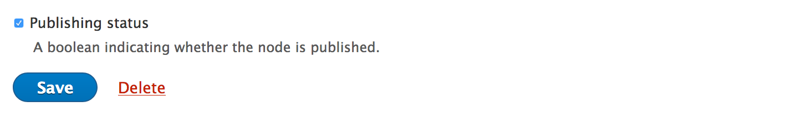
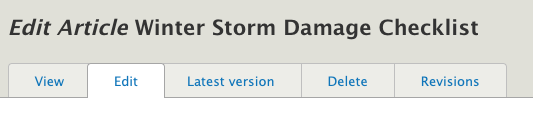
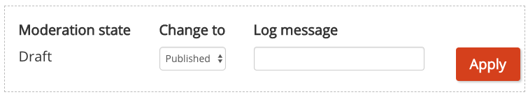
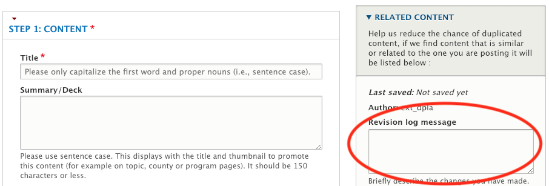
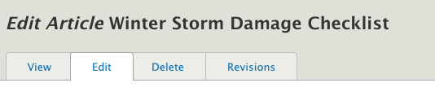
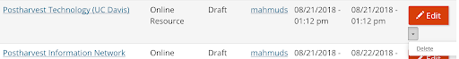
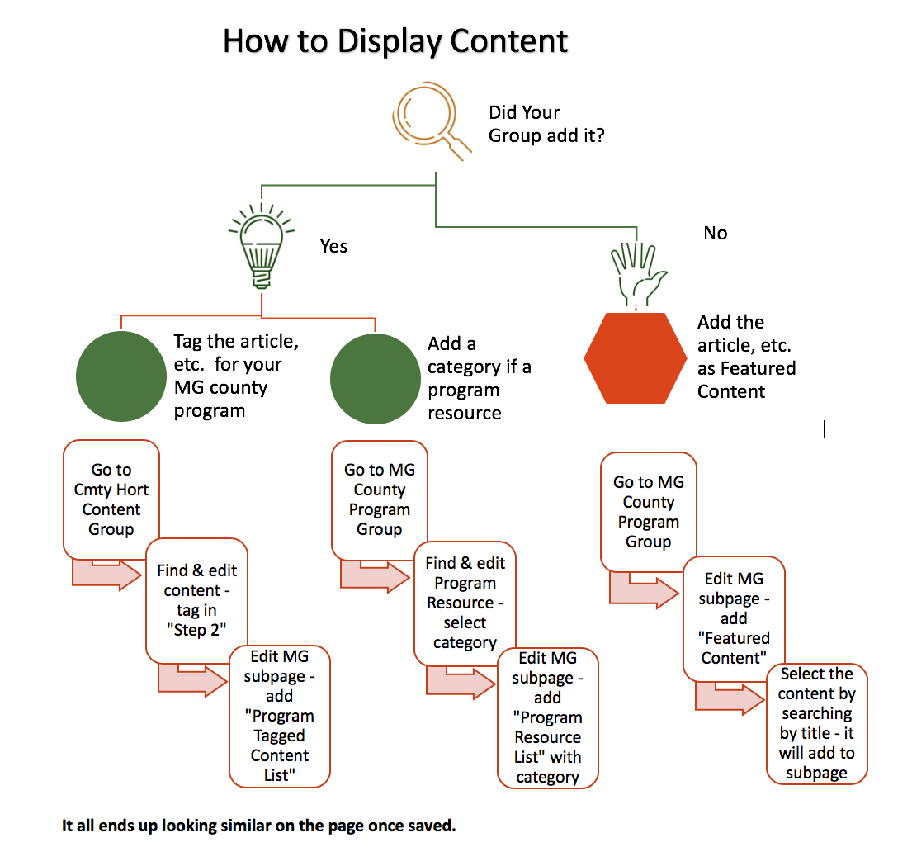
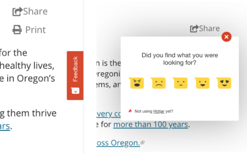
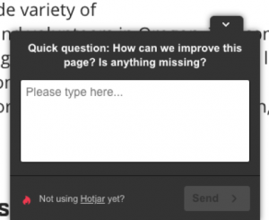
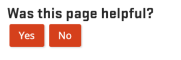

# Managing Content

Content needs management and maintenance after it has been added to the site in order to be effective.

## Content Drafting, Reviewing, Publishing, Archiving, and Deleting

In certain cases, you may want your content to be invisible to visitors. Most content entered into any website will eventually become out of date. Or you might want to review the content you entered before it gets published.

Content that is visible to public visitors is **published** and content that is not is **unpublished**. For most content types, there are three ways to be unpublished:

  - **Draft**: The content needs to be finished or reviewed before it gets published.
  - **In Review**: The content was published, but has been taken down for review.
  - **Archived**: The content was published, but is now out of date or no longer needed.

Note that when you are viewing a piece of content that is unpublished (not visible to the public) it will have a pink background.

At the bottom of any edit screen, you will see one of two setups, depending on which type of content you are editing:

If you see this setup at the bottom of the page, you can use the dropdown to select “draft,” “in review.” or “archived.” This should be the setup you see most often.

In some cases (like when you’re adding social media links), you might see this setup instead. In this case, uncheck the “published” checkbox if you want to unpublish the content.

### New Drafts of Published Content

If you update a piece of published content and set its state to “Draft,” the previous version of that content will remain visible. To hide all previous versions, set the state to “In Review” or “Archived” instead.

The edit screen for a piece of content will always contain the content from the latest draft. However, you can view both the latest draft and the currently published version.

To see the currently published version that is visible to the public, click on the content’s title on the Group Content page. You can also click the “View” tab at the top of the content’s edit screen.

To see the latest draft of the content, click on the “Latest version” tab at the top of the content’s edit screen. These tabs are also visible below the title on the content’s page.

At the top of the “Latest version,” you will see a control where you can publish the content and make the changes visible to the public:

If you want to discard the draft and edit the currently published version of the content, you can “revert” to that revision of the content. See below for more details.

### Viewing Previous Versions of Content

Making changes to a piece of content and saving it creates a new **revision**. If needed, you can look at all the previous revisions of a piece of content or revert content to a previous revision.

When you save a piece of content, you can enter a “Revision log message” to describe the changes you made or why you made them. You and other members of your group can see these messages later.

To view the revisions for a piece of content, go to the edit screen for the piece of content. At the top of the page are several tabs, including a “Revisions” tab.

When you click on this tab, you will see a list of all revisions for the content. The revision that is currently visible to visitors is highlighted in yellow and says “Current revision.” From this page, you can do several things:

  - **View a previous revision**: Click on the date of the revision you want to view.
  - **Compare two revisions**: Select the two revisions and click the “Compare Revisions” button at the bottom of the page. This will show you the differences between the two revisions by highlighting text that has been added, removed, or changed.
  - **Revert to a previous revision**: Click the “Revert” button for the revision you want to revert to. This makes the selected revision the “current” revision. If needed, you can re-revert to the revision you were at originally with the same process.

### Deleting Content

Deleting content will remove it and all of its previous versions from the site permanently. It is better to “archive” content rather than delete; you can still find it on the Group Content page when logged in if you want to update it and republish. It also helps avoid the content being inadvertently added again, since the reason it was “archived” can be noted in the revisions field for future reference.

Next to the Save button on an edit page you will also see the “delete” link. It is also an option in the drop down next to the content’s Edit button on the Group Content page.

After clicking on “Delete” it will confirm if you are sure you want to delete it. Deleted content will no longer be accessible and cannot be restored. If you want to maintain a copy of the old content, you must copy and save this yourself beforehand.

## Extension Communications Copyediting

The Extension Communications pubs team will copyedit articles entered on the Extension website. This is done after an article is published by a content team. When the pubs team makes edits, a new draft of the content is created, so the original remains visible to the public and doesn't change. The person marked as the "Group contact" for the group will get an email whenever a piece of content is copyedited. This will include a link where they can view the copyedited draft and approve the changes. You can also view a list of copyedited content that needs to be approved by going to the group content page for that group and clicking the "Copyedits" tab at the top of the page.

This page lists all content in the group that has been copyedited and needs approval. You can search for content by the uploader or original title. If the title was changed during copyediting, you will see the change when you click on the content. You can view the copyedited draft by clicking on the title of the content. This page also lists the Extension Communications pubs team member who copyedited the content. If you have questions about the changes that were made, click on their user name to go to their contact form.

When you view the draft for a copyedited piece of content, you can approve it using the moderation controls at the top of the content. Set the dropdown to "copyedited and published" and click the "Apply" button. You can also make edits to the copyedited content before making it public by clicking the "Edit" tab and editing as normal.

You can find more details about the changes made by going to the "Revisions" tab on the content page. This allows you to see notes left by the copyeditor and to compare the copyedited version to the previous version. See the previous section for more information about the revisions tab.

##  Displaying and Organizing Content on Other Pages

In some cases, you might want content that exists on the site to show up on a specific page. The way to do this depends on where you want the content to show up, who added it, and what kind of content it is. Generally, this will involve **adding a tag to a piece of content** or **adding a page section to a page**.

### Content on Topic Pages

| | You or a member of your   group added the content | Someone else added the content
| ------ | ------ | ----- |
| **Educational content** | Edit the content and **add a tag for the topic in Step 2 of the edit screen**. If you want the content to show on the topic landing page, a member of the topic committee will need to select it in a “**featured topic section**.” | Select the content in a “**featured topic section**” on the landing page. You will need to be a member of the topic committee for that topic.  Or  Members of topic committees can **modify the tags** of the content and add a tag for the topic. (See below.) |
| **Events & Announcements** | Edit the content and **add a tag for the topic in Step 2 on the Edit screen**. | Members of topic committees can **modify the tags** of the content and add a tag for the topic. (See below.) |
| **People (“Experts”)** | Edit your profile and add the topic as your “Expertise”  Or  Topic committees may select up to four people to display on the landing page, whether or not they have the topic as an expertise. | |

### Content on Program Pages

 | | **You or a member of   your group added the content** | **Someone else added the content**
| --------- | ----------- | ----------- |
| **Educational content** | N/A - Educational content is not entered through a program group. | **Contact the person** who entered the content and ask them to add a tag for the program and any appropriate keywords. See [Working with Other Content Authors](people.md) for more information. Then, add a “**Program Tagged Content**” section to the program page where you want the content to display. You can select a keyword to only display content tagged with that keyword in a particular page section.  Or  Add a “**featured content**” section to the page and select the content. Remember that it is better to direct people to topic pages, which are always getting updates, than to try to list all relevant content on a program page. |
| **Program resources\*** | Add a “**Program resource list**” section to the page where you want the content to show. You will probably need to select a “Category to display” so you can narrow this section down to specific items. Then edit the program resource and **tag it with the category** you specified. | Local programs can display program resources from their statewide parent by adding a “**Program statewide resource list**” section to a page. You can narrow the list down by selecting a “category to display” configured by the statewide program. |
| **Events & Announcements** | Enter the content through the program’s group  Or  Edit the content and add a tag for the program. Someone associated with the program will need to add a “Program events list” section to the page where you want the content to show.  | **Modify the tags** of the content and add a tag for the program.   Someone associated with the program will need to add a “**Program events list**” section to the page where you want the content to show. |
| **People** | Submit a [web support request](https://osuExtension Communications.atlassian.net/servicedesk/customer/portal/2) to have a person added to the directory for a program. | |

\*Please remember: Do not add educational content as a program resource. Program resources are for materials such as handbooks or forms that are only of interest to participants in a program.

Once content has been added to county or program pages, the sidebar where the pages are listed can be reordered, nested, or both (i.e., housed beneath a broader subpage). See [Adding and Editing Content: Subpage](content-types/subpage.md) for more information.

#### Restricting Tagging of Your Program

If needed, you can set up your program so that only members of the program’s group can tag educational content with it. This means that only members of the program group would be able to make educational content appear on the program’s pages.

To do this, you need to have the role “Member & Setting Manager” in the program’s group. Go to the Group Content page for the group and click the “Settings” tab at the top. This will take you to a page where you can manage the group’s settings. To restrict tagging to the program, check the “Restrict Tagging” box and then save.

### Content on County Pages/Focus Areas

 | | **You or a member of your  group added the content** | **Someone else added the content**
| --------- | ----------- | ----------- |
| **Educational content** | N/A - Educational content is not entered through a county group. | Add a “**custom content list**” or "**highlighted content item**" section to the page and select the content. Remember that it is better to direct people to topic pages, which are always getting updates, than to try to list all relevant content on a county page.
| **Events & Announcements** | Enter the content through the county’s group  Or  Edit the content and **add a tag for the county**.   Someone associated with the county will need to add a “**County events list**” section to the page where you want the content to show. You may need to select a topic or “Calendar to display” so you can narrow this section down to specific terms. | **Modify the tags** of the content and add a tag for the county, and if needed, select a specific calendar.   Someone associated with the county will need to add a “**County events list** section to the page where you want the content to show. You may need to select a “Calendar to display” so you can narrow this section down to specific terms. |
| **People** | Submit a [web support request](https://osuExtension Communications.atlassian.net/servicedesk/customer/portal/2) to have a person added to the directory for a county. | |

> ### Case Study - Master Gardener Program Pages

### Other Ways to Group Content

Before putting in the effort to group content on a county or program page or Collection, check if the site can dynamically group the content for you.

Several pages on the site have filters in the sidebar that can group content automatically based on tags. You can link people to these pages with filters already applied. To do this, go to the page and apply the filters you want. Then, copy the URL in the address bar of your web browser and use it to create a link.

Some Examples:

  - [Central Oregon vegetable gardening resources](https://extension.oregonstate.edu/topic/gardening/vegetables/resources?region=Central%20Oregon) (filtered topic page)
  - [Resources about lambing](https://extension.oregonstate.edu/topic/animals-livestock/sheep-goats/resources?keyword=lambing) (filtered topic page)
  - [Nursery and greenhouse resources in Spanish](https://extension.oregonstate.edu/topic/crop-production/nursery-greenhouse/resources?lang=Spanish) (filtered topic page)
  - [Programs for people interested in forest health and management](https://extension.oregonstate.edu/programs?topic=Forest%20Health%20and%20Management) (filtered programs page)
  - [Spotted wing drosophila videos](https://extension.oregonstate.edu/search?search=spotted%20wing%20drosophila&search-filter%5B0%5D=type%3Aext_video) (filtered search results page)

## Modifying Content Tags

Many pages on the Extension website pull in content to display based on "tags" on that content. For example, county event pages show both events entered by the county group and events _tagged_ with the county. This may cause issues when a piece of content is tagged incorrectly: an event may be tagged for a county where it isn't relevant, or an event that is relevant to a county may not be tagged with that county. In these cases, you can **modify the tags** of content even when you are not a member of the group that entered it.

To do this, there are two options:
  - Go to the page for the content and click the "Modify Tags" tab at the top. This is in the location where you would normally see an "Edit" tab if you had access to edit the content.
  - While viewing a teaser for the content, hover over it with your mouse. This will reveal a pencil icon in the top right corner of the teaser. When you click the pencil icon, you will see the option to "Modify Tags".

In either case, clicking "Modify Tags" will take you to a restricted edit screen where you can add and remove tags for the content without otherwise editing it.

> Note: Catalog publications are imported to the Extension website with tags from the catalog, so their tags cannot be modified through the website. If tags on a publication need to change, please submit a [web support request](https://osuExtension Communications.atlassian.net/servicedesk/customer/portal/2).

## Content feedback and analytics

For Extension’s digital strategy to be successful, we need to use data from visitors to decide how to create, maintain, and distribute content. There are features on the Extension website for content authors to find analytics and visitor feedback for their content.

### Visitor feedback

There are a few features on the Extension website that collect qualitative data. This type of data answers questions about content that can help improve its quality, such as:

  -	Did visitors find the information they were looking for?
  -	What did they do most often on the page?
  - Were they able to understand the content?

#### How feedback is collected

The first feature is a **feedback widget** on the right-hand side of every page:

When a visitor clicks on the widget, a small window comes up asking them “Did you find what you were looking for?” They then score a page on a scale of 1-5 (represented by smiley faces). After they score the page, they have the opportunity to leave a comment. They may also enter their email address if they would like a response to the comment.

Another way of collecting visitor feedback is a **poll**. With a poll, we can ask more specific customized questions. For example, we have a poll set up on all 4-H pages that asks what is missing from the page. With this data, we wanted to improve visitors' experience during future fair seasons.

This window pops up from the bottom of the page after a visitor has had a chance to look around for several seconds. When they comment, they also have the option to leave their email address if they would like a response.

Finally, at the bottom of most pages, visitors see a small form asking **“Was this page helpful?”** They can select “Yes” or “No” and have an option to leave a (non-public) comment.

#### Finding feedback on your content

To view feedback for a piece of content, go to the content and click the “Feedback” tab under the content’s title. It is near the “Edit” tab.

To see an overview of feedback scores for all content in a group, go to that group’s group content page. Then click the “Feedback” tab under the group name. This will take you to a list of all content with feedback in the group. To see the comments left for a particular piece of content, you can click on “Details” in its row on this page.

### Group analytics dashboard

There is an “Analytics” tab at the top of the group content page for each group. Clicking on this tab will take you to the analytics dashboard for the content in that group.

On the top of the dashboard, there is a link to “See analytics for all of Extension.” This expands the data on the dashboard to include all content on the Extension website. That way, you can see how your content compares.

#### Data available on the dashboard

The dashboard is broken up into several sections:

  -	**Top content**: this section contains information about
      -	How often content from the group is viewed (pageviews)
      -	How many people visit the group’s content (users)
      -	How long on average that people spend viewing the content
      -	The most visited pages in the group

  -	**How visitors find us**: this section contains information about\
      -	The way that visitors find content produced by the group (see the help text on the right-hand side of the dashboard for definitions)
      -	Websites, both internal and external to OSU, that link to the group’s content

  -	**About the visitors**: this section contains information about
      -	The approximate locations of visitors who view  content from the group
      -	The preferred languages of visitors to the group’s content
      -	The types of devices used by visitors to access the content
      -	How many times visitors visit content in the group

-	**Visitor navigation**: you will see this section if you are a member of a program group. It shows information about the first and last pages visitors go to when they visit the group pages.
-	**What visitors look for**: this section is only on the dashboard for all content on the Extension website. It has information about the most common terms visitors enter in the search box on the website. It also shows the most common terms people enter that return no results.

#### How to use the dashboard controls

There are several controls on the dashboard you can use to expand or restrict the data you see.

  -	Date range: this dropdown widget is at the top of the dashboard. You can use it to select the date range for the data shown on the dashboard.
  -	Page title: in the “Top Content” section, there is a widget you can use to see data about only a specific page or set of pages. To do this, type in the title of the page and press enter. If you don’t know the exact name of the page, you can click on the box that says “EQUALS”. This will reveal a dropdown where you can select “CONTAINS” instead.
  -	Search terms: in the “What visitors look for” section, you can filter to see if the search terms contain a particular word. To do this:
      -	Click on “EQUALS” to reveal a dropdown and select “CONTAINS”
      -	Type in the word you want to filter by and press enter

#### How to interpret the data

The content analytics dashboard provides quantitative data about content. This means that you will need to interpret it to find actionable takeaways. Here are some tips for doing this:

  -	Identify gaps and opportunities.
      -	The “About the Visitors” section may show you audiences that you may not be effectively serving up to this point. Do you have content relevant to the places they are from? Do you have content in the language(s) they prefer?
      -	On the flip side, this section may reveal that audiences you have heavily focused on in the past are not using your content as often as you would like. If this is the case, you may need to do some outreach to figure out why this is or reconsider where you are directing your efforts.
      -	In the “How visitors find us” section, look at the sites that are linking to your content. Is your content appropriate for people coming from those sites? Are there any sites you know of that you would like to link to you?
      -	The “What visitors look for” section may identify topics visitors are interested in that your group has expertise in.
  -	Look for trends and outliers.
      -	In the “Top content” section, look for pages that are more popular than others or pages where people spend more time than average. Then, you can see what about that content  could help to bring the rest of your content up to that level.
          -	One way to do this for pages is to look at the feedback on the page.
      -	Also look at the pageviews over time graph at the top of the dashboard for times when pageviews spiked. Do you know why the spike happened? Can you make that happen again?
          -	If you don’t know where a spike in pageviews came from, try narrowing the date range for the dashboard to only that day and look at the “Where visitors come from” section.

## Review of Terms

  - **Published**: content that is visible to visitors to the site
  - **Unpublished**: content that is hidden to visitors to the site. It is only visible to the uploader and other members of the group it belongs to.
  - **Draft**: content that is unfinished or needs work before being published
  - **In Review**: content that was published but has been taken down for review
  - **Archived**: content that was published but has been taken down because it is no longer accurate or relevant
  - **Revision**: a version of a piece of content that shows what was modified and saved

## Key Takeaways

  - Content that is published is visible to visitors to the site and content that is unpublished is not. Content that is unpublished may be a “draft,” “in review,” or “archived.”
  - You are generally able to place content on another page by tagging the content, adding a section to the page, or both.
  - The website is often able to automatically group related content based on tags.
  - Content authors can see comments visitors have left on content by clicking on the "Feedback" tab when viewing the content.
  - Group members can access an analytics dashboard for their group's content by clicking the "Analytics" tab on the group content page.
