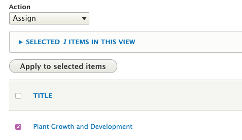
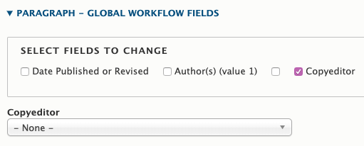

# Instructions for Special Roles

This section contains instructions for people who have special roles on the Extension website.

## User Administration

Certain administrators are responsible for managing users on the site. If you are one of these people, you will see two items in the white bar at the very top of every page: “Groups” and “People.”

### Creating and Editing Users
To add a user, click on the “People” item in the white administration bar. This takes you to a list of all users on the site that you can filter. To create a user, click the “Add User” button at the top of this page. To edit an existing user, click the “Edit” button next to the name of that user.

On the edit screen for a user, you will see the following fields:

  - **User**: Basic user account information
    - **Email**: Use the person’s OSU email address.
    - **Username**: Enter the person’s ONID username.
    - **Password and Confirm Password**: It doesn’t matter what you put here. Users need to use their ONID credentials to log in.
    - **Status**: See “Removing Users” below.
    - **Roles**: All Extension personnel should have the “**Content Author**” role. This allows them to use the back-end functionality needed to manage content and/or their profile.
    - **CAS Username**: Enter the person’s ONID username.
  - **Contact information**: Information that shows on the user’s profile page
  - **Profile**: Fields the user themself can edit. Includes fields for their photo, bio, related online links, and expertise (topics).
  - **Employee**: Information about the person’s role in Extension
    - **Status**: See “Removing Users” below.
    - **Title**: Enter the person’s job title(s).
    - **Programs**: Specify the program(s) a person works for. When you select a program here, the person will show in the directory for that program.
    - **Supervisor**: Check this box to export the person’s information to the Employee Intranet site. There, they can be selected as a supervisor in the Out of State Travel Request form.
    - **Other checkboxes**: The other checkboxes in this section are used for sorting people in directories.

### Removing Users

You can disable an account by doing the following:

  1. Set the user’s status in the “User” section to “**Blocked**.” This prevents them from logging into the site.
  2. Set the user’s status in the “Employee” section to “**Former**” or “**Retired**” as appropriate. Doing this:
    - Removes them from all directories,
    - Puts (retired) or (former) next to their titles when they are listed as authors on content, and
    - Removes the contact information from their profile.

Don’t “delete” users because doing so removes any associations between them and the content they’ve authored and/or uploaded.

### Adding Users to Groups

Member managers can add users to their own groups, but certain administrators can add users to any group. To do this, click on the “Groups” item in the administration bar. Then find the group you need in the list and click the “Members” button next to it. This will take you to a list of all members in the group. There is a button for adding new members at the top of this page. See [Working with other content authors](managing-content.md#working-with-other-content-authors) earlier in this guide for more information.

## Featured Ask an Expert Questions

Certain EESC staff are responsible for periodically entering “Featured Questions” that get sent in through Ask an Expert. To get permission to do this, you need to be a member of a group with the special role “AAE Admin.” Then you will have the ability to add Featured Questions through that group.

### Instructions for Featured Questions

On the edit screen for a Featured Question, you will see the following fields:

  - **Question**
  - **Answer**
  - **Related Resources**: Link to other content on the site related to the question
  - **Answer Photo**: Image that will show on the full question page
  - **Thumbnail**: Image that will show in the teaser
  - **Tags**: information about the question to help with display, sorting, search, and promotion. See below for more details.
  - **Teaser settings**: thumbnail and short description that display in the question's teaser. If the thumbnail is empty, it will use the first image in the "images" field. If the "images" field is empty, it will use a default image based on the topic.
  - **Author and Publishing Information**: Information about the content for future maintenance

### How and Where Featured Questions Display

The tags in the “Topics, Keywords, Programs, and Regions” section of the edit screen determine where the question displays.

  - **Topic**: Shows in the “Browse All Resources” page for the specified topic(s).
  - **Program**: If the specified participant-based program has added a “Program Tagged Content List” section to one of its pages, it will show up there.

Counties and Programs can add questions to a page by adding a “featured content” section.

## EESC News and Public Issues Team

EESC personnel on the News and Public Issues Team are responsible for managing news and gardening stories on the Extension website.

### New Stories

This applies to new gardening stories and news that you write.

#### Step 1: Publish to the [OSU Newsroom](http://today.oregonstate.edu/news).

Note: This process is the same as before the new Extension website.

Complete the workflow for publishing to the “newsroom,” email lists, etc.

#### Step 2: Wait for the story to be imported to the CMS

The CMS imports stories from the newsroom every 6 hours.

#### Step 3: Tag the story in [the CMS](https://extension.oregonstate.edu/)

The login link is located on the right side of the black section at the bottom of every page. Once logged in, go to the [News Team Dashboard](https://extension.oregonstate.edu/admin/news). The most recently imported stories are at the top of this list.

To tag a story, click the “Edit” link in the same row as it appears in the dashboard, then open the “Step 2” section of the form that comes up:

Fill out whatever topics, keywords, programs, and/or regions are appropriate and click “Save” at the bottom of the page. See the [Tagging Guidelines](content-requirements.md#tagging-guidelines) section of this guide for more information on tagging.

### Stories from the Old Site

All news and gardening stories that existed on the old Extension website when the new site launched have been imported into the new site. However, the old site did not have the tagging system that the new one does, so the tagging needs to be done manually to make that users are able to find old stories on the new site. There are two ways to tag old stories: either one at a time or in bulk.

#### One at a Time

  1. Log in to the CMS and go to the [News Team Dashboard](https://extension.oregonstate.edu/admin/news).
  2. If necessary, search for a particular story by words contained in the title or body text.
  3. Click “Edit” next to the story you want to tag and tag as described above.

#### Bulk Tagging

If you want to tag many stories at once:

  1. Log in to the CMS and go to the [News Team Dashboard](https://extension.oregonstate.edu/admin/news).
  2. If necessary, search for a particular story by words contained in the title or body text. You can also filter to see only stories that do or don’t already have certain tags filled out.
  3. Click the check boxes next to the stories that you want to tag.
  4. Select “Modify Tags” from the dropdown above the list of stories and click the “Apply to Selected Items” button.

    

  5. On the page that comes up, select the tag field that you would like to modify. Then, in the field that comes up, enter the tag that you would like to apply to the stories.
  6. In the “Options” section
    - Check the box if you want the tag you entered to be added alongside any existing tags the stories have. For example, if you enter the keyword “apples” and one of the stories you selected already has the keyword “pears,” this will cause that story to have *both* keywords “apples” and “pears.”
    - Leave the box unchecked if you want the tag you entered to overwrite any existing tags the stories have. For example, if you enter the keyword “apples” and one of the stories you selected already has the keyword “pears,” this will cause that story to *only* have the keyword “apples.”
  7. Click “Apply” at the bottom of the page.

## EESC Pubs Team

To copyedit content in the Extension website, you need to have the "Content Editor" role. All members of the EESC pubs team should have this role.

When you log in to the site, you will be taken to a [dashboard that lists all content that has been assigned to you to copyedit](https://extension.oregonstate.edu/admin/content/copyedit). There are also tabs at the top of the page that show you lists of content has been copyedited and is pending approval as well as all content that hasn't been assigned to a copyeditor.

### Assigning content

There are two ways to assign a piece of content to a content editor.

  1. You can assign the content to yourself when you edit it. To do this, open the "Author and Publishing Information" section of the content's edit screen and yourself as the "Copyeditor" under "Review and Copyediting"

    

  2. You can assign the content to yourself or another person without editing it from the "Unassigned" tab of the dashboard.
    1. Check the box(es) next to the content you want to assign.
    2. At the top of the list of content, under "Action", select "Assign". Then click "Apply to selected items".
      
    3. Check the box for "Copyeditor" and select the name from the drop down list that appears. Then click "Apply".
      

### Editing content

To edit a piece of content, click on it in the list on the dashboard and click the "Edit" tab. Make your edits, enter any notes in the "Revision log message" box on the right-hand side of the screen, then click save at the bottom of the page.

Just above the "Save" button, you will see a dropdown of options for the save state.

  - **Copyediting in progress**: This saves a draft of your changes. It does not make the changes publicly visible and does not notify the group that the content has been copyedited.
  - **Copyedited and published**: This makes your changes immediately visible to the public without approval from the group. Use this only for small changes such as spelling or formatting fixes and adding (non-topic) tags.
  - **Copyedited pending approval**: This will trigger an email to the contact person for the group the content belongs to prompting them to approve the changes.
