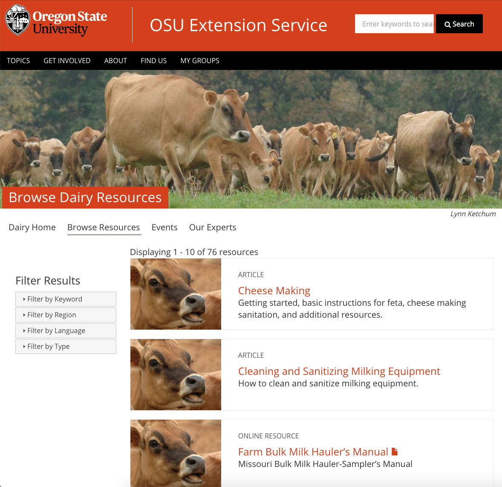
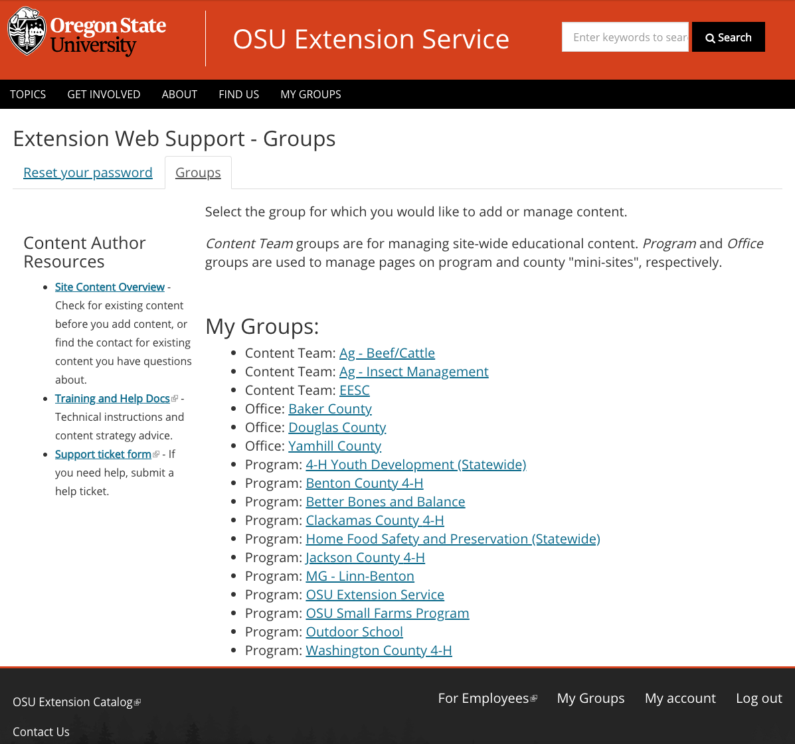
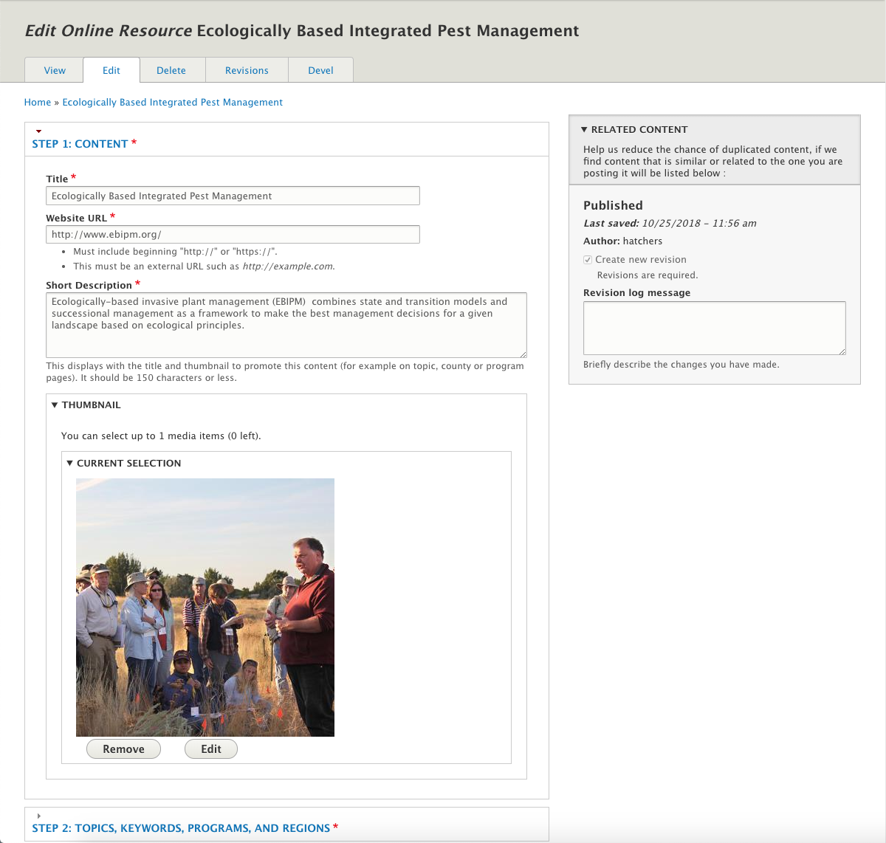
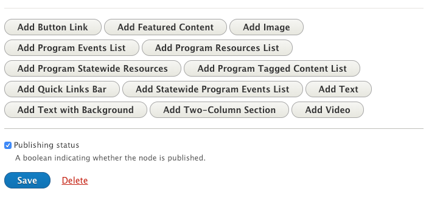
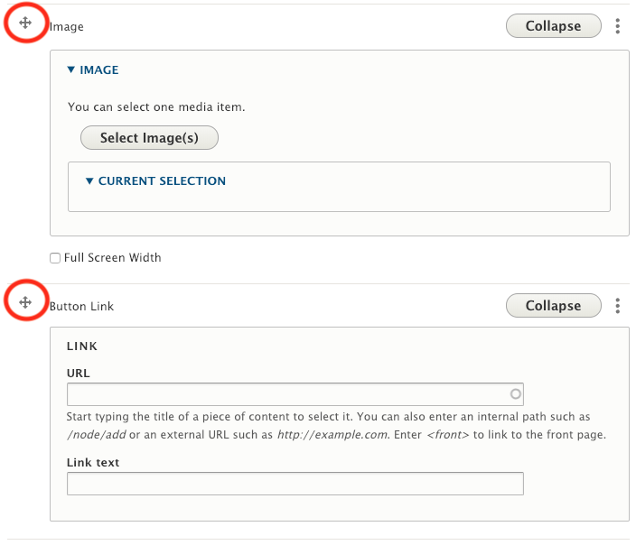
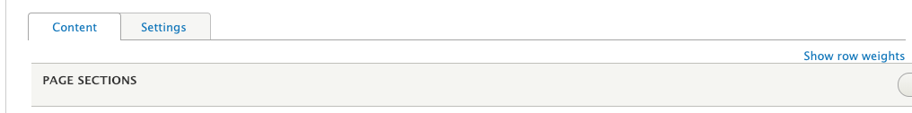
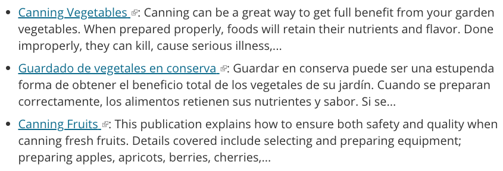

# Using the Extension Website

The Extension website has two different uses:

  1. browsing for information the public can see and interact with, and
  2. making changes to the information with the interface that content authors use to manage content while logged in.

## Browsing the Website

<figure class="video_container">
  <iframe id="kaltura_player" src="https://cdnapisec.kaltura.com/p/391241/sp/39124100/embedIframeJs/uiconf_id/22119142/partner_id/391241?iframeembed=true&playerId=kaltura_player&entry_id=0_de4uxs4l&flashvars[localizationCode]=en&amp;flashvars[leadWithHTML5]=true&amp;flashvars[sideBarContainer.plugin]=true&amp;flashvars[sideBarContainer.position]=left&amp;flashvars[sideBarContainer.clickToClose]=true&amp;flashvars[chapters.plugin]=true&amp;flashvars[chapters.layout]=vertical&amp;flashvars[chapters.thumbnailRotator]=false&amp;flashvars[streamSelector.plugin]=true&amp;flashvars[EmbedPlayer.SpinnerTarget]=videoHolder&amp;flashvars[dualScreen.plugin]=true&amp;&wid=0_trpjvrnw" width="554" height="366" allowfullscreen webkitallowfullscreen mozAllowFullScreen allow="fullscreen*; encrypted-media*" frameborder="0" title="Kaltura Player"></iframe>
</figure>

Every person uses the Internet with their own methods and style. Each of us reads, clicks, and searches differently. To support these differences and the preferences of our diverse Extension audience, the website provides multiple ways to find content:

  - searching for content;
  - finding content by browsing a topic-based menu;
  - finding content through a participant-based program; and
  - finding content through a county location.

### Search

[Research shows](https://www.nngroup.com/articles/search-and-you-may-find/) that more than half of all web users primarily use a site’s search functionality to find content. Many visitors who start with menus and links switch to search if they can’t find the content they want.

The search box at the top of every page of the Extension website searches all content on the site.

#### Improving search results

There are two methods for a visitor to get more specific or relevant search results.

  1. **Refine the search**. The screenshot below shows the search results when you search for “apples.” The top results are information about apple trees and their care. If you want information about preserving apples, you can change the search to “preserving apples.” This would give more relevant results. Analytics show that about 30% of people who use search on the site “refine” their searches.
  2. **Use the filters** in the left sidebar of the search results page. The visitor in the previous example could open the “Filter by Topic” section and select “Home Food Preservation.” This will show only search results tagged with the topic “Home Food Preservation.”

*Screenshot showing the results when a visitor searches for “apples.”*

*Screenshot showing the results when a visitor searches for “apples” and then filters results to show only items tagged with “Home Food Preservation.”*

### Topic-Based Navigation

The primary place for visitors to find educational content is on topic pages. This is because analytics and user testing show that people looking for educational content tend to use topic-based navigation first.

To get to the topic pages, click “Topics” in the black navigation bar at the top of every page. There are also links to topics on the home page.

Each topic has a “landing page” that is semi-curated by topic committees. This page contains the most important content for the topic and a description of the work Extension is doing in that area. It also links to several other pages that contain more content related to the topic.

The visitor can click on a link on the landing page to go to the “Browse Resources” page for that topic. This page lists all content in the system tagged with the topic in reverse chronological order (newest first). Like the search result page, filters on this page narrow the list to content relevant to the visitor.

*The resources page for the “Dairy” topic shows all content tagged with the topic. Note the filters in the left sidebar that allow users to narrow the content they see on this page.*

### Program-Based Navigation

Visitors can find content related to an Extension program they are involved in through that program’s pages. There are a few ways to get to these pages.

  - The home page lists programs that bring a lot of people to the site.
  - Topic pages list programs that are related to that topic.
  - County pages list programs that are active in that county.
  - All programs are listed on a page in the top black menu bar under “Get Involved.”
  - All program content can be found through the site’s search.

The program groups that maintain these pages have a lot of flexibility around how they can present content. For more information, see: [Adding and Editing Content: Subpages](content-types/subpage.md) and [Organizing and Displaying Content on Other Pages](managing-content.md#displaying-and-organizing-content-on-other-pages).

### Location-Based Navigation

Many visitors familiar with the old website expect to find content on their county’s page. Counties, like programs, maintain pages to organize and direct visitors toward content. People can find their county on the “Locations” page under “Find Us” in the top black menu bar.

> #### Case Study: Finding a Newsletter
A newsletter called [*GROWING*](https://extension.oregonstate.edu/newsletter/growing) is published in Linn and Benton Counties. A person might find this newsletter on the Extension site in several ways.

>  - [Search for “growing” and filter by Type “Newsletter.”](https://extension.oregonstate.edu/search?search=growing&search-filter%5B0%5D=type%3Aext_newsletter)
  - [Search for “growing newsletter.”](https://extension.oregonstate.edu/search?search=growing+newsletter)
  - [Use the link on the Linn-Benton Master Gardener program page.](https://extension.oregonstate.edu/mg/benton/volunteer-resources)
  - [Use the link on the Linn County page.](https://extension.oregonstate.edu/linn/newsletter)
  - [Use the link on the Benton County page.](https://extension.oregonstate.edu/benton)
  - [Use the link on the “Browse Resources” page for the Gardening Techniques topic.](https://extension.oregonstate.edu/topic/gardening/techniques/resources?type=ext_newsletter)

> Since the newsletter was entered only once, updates will automatically show up in all these places.

## Making Changes to Content

### Logging In

<figure class="video_container">
  <iframe id="kaltura_player" src="https://cdnapisec.kaltura.com/p/391241/sp/39124100/embedIframeJs/uiconf_id/22119142/partner_id/391241?iframeembed=true&playerId=kaltura_player&entry_id=1_fsu997h9&flashvars[localizationCode]=en&amp;flashvars[leadWithHTML5]=true&amp;flashvars[sideBarContainer.plugin]=true&amp;flashvars[sideBarContainer.position]=left&amp;flashvars[sideBarContainer.clickToClose]=true&amp;flashvars[chapters.plugin]=true&amp;flashvars[chapters.layout]=vertical&amp;flashvars[chapters.thumbnailRotator]=false&amp;flashvars[streamSelector.plugin]=true&amp;flashvars[EmbedPlayer.SpinnerTarget]=videoHolder&amp;flashvars[dualScreen.plugin]=true&amp;&wid=0_trpjvrnw" width="554" height="366" allowfullscreen webkitallowfullscreen mozAllowFullScreen allow="fullscreen*; encrypted-media*" frameborder="0" title="Kaltura Player"></iframe>
</figure>

To make changes to content, **content authors**, people who enter content, must log in to the site. There is a “Log in” link at the bottom right of every page. This will take you to a screen where you use your [ONID](http://onid.oregonstate.edu/) credentials to log in. When you are logged in, you will see a “My Groups” link in the top black menu bar on every page.

There are three pages to understand in order to use the back-end:

  - the “My Groups” page,
  - the “Group Content” page, and
  - the “Edit Screen.”

### My Groups Page

When you log in (or click on the “My Groups” menu link), you will see your “My Groups Page.” This page lists your groups. Your groups determine what types of content you can add and which pieces of content you have access to edit.

*My Groups Page example.*

If you need to be part of a group that isn’t listed on your “My Groups” page, get in touch with the leader of that group. See [“Working with Other Content Authors”](managing-content.md#working-with-other-content-authors) for more information.

### Group Content Page

Clicking on one of the group names will take you to the “*Group Content Page*” for that group. This page lists all the content that belongs to that group. Any member of the group can add and edit content for that group. The different types of content you can add to the group are listed as buttons across the top of the page.

*Group Content Page example.*

### Edit Screen

You will see the edit screen when adding or editing a piece of content. You can get to the edit screen in several ways:

  - On the Group Content Page, find the content you want to edit and click the “Edit” button.
  - Navigate to the desired page and click the “Edit” tab just under the title.
  - To create a new piece of content, click one of the “Add” buttons at the top of the Group Content page.

How the edit page will look will vary by the type of content. Each are described in [Adding and Editing Content](content-types/index.md).

*Edit Screen example.*

### Using Edit Fields

There are a couple of controls on edit screens that are important.

#### Text Editor

This field is used to enter text. Buttons at the top allow you to format the text. The “Format” dropdown is for creating headings. You can also view the HTML for the text with the “Source” button.

Use the buttons for only their intended purpose. For example, don’t use headings to merely make text bigger or add emphasis. Similarly, don’t use the subscript or superscript button to make text smaller. See the [Accessibility](content-requirements.md#accessibility) section later in this guide for more information.

##### Links

<figure class="video_container">
  <iframe id="kaltura_player" src="https://cdnapisec.kaltura.com/p/391241/sp/39124100/embedIframeJs/uiconf_id/22119142/partner_id/391241?iframeembed=true&playerId=kaltura_player&entry_id=1_ee4taedh&flashvars[localizationCode]=en&amp;flashvars[leadWithHTML5]=true&amp;flashvars[sideBarContainer.plugin]=true&amp;flashvars[sideBarContainer.position]=left&amp;flashvars[sideBarContainer.clickToClose]=true&amp;flashvars[chapters.plugin]=true&amp;flashvars[chapters.layout]=vertical&amp;flashvars[chapters.thumbnailRotator]=false&amp;flashvars[streamSelector.plugin]=true&amp;flashvars[EmbedPlayer.SpinnerTarget]=videoHolder&amp;flashvars[dualScreen.plugin]=true&amp;&wid=0_hityxxq8" width="554" height="366" allowfullscreen webkitallowfullscreen mozAllowFullScreen allow="fullscreen*; encrypted-media*" frameborder="0" title="Kaltura Player"></iframe>
</figure>

To **add a link**, type and highlight the text you want to use as the link label and click the button in the text editor that looks like a chain link. This will open a small window. There are several ways to enter a link:

  - To link to content that already exists on the site, start typing the name of the content. Matching titles will appear. Select the content you want to link to.
  - To link to external content, copy and paste the URL.
  - To link to an email address, enter “mailto:(email address).”
  - To link to a specific section on the current page or another page, paste in the URL and add “#(section-id)” to the end. See [Page Sections](#page-sections) for more information.

You can **edit a link** by placing your cursor inside the link and clicking on the link icon in the text editor. The same window will pop up where you can edit the link.

When you create links in the text editor, it is very important that you periodically **check that the links still work**. Broken links on a website hurt an organization’s credibility and might result in a penalty from search engines like Google, making content harder to find. We recommend using dynamically generated page sections, such as featured content or program tagged content lists, for linking to other content on the site when possible. These will automatically update when the content’s link changes and so will never break. See [Page Sections](using-site.md#page-sections) for more information.

#### Image, Document, and Video Browsers

For fields that allow you to upload an image or document or embed a video, you will see a button that says “Select Image”, “Select Document”, or “Select Video” (i.e, when uploading an image, it will say “Select image”). Clicking this button will open a new window called the **image/document/video browser** (depending on what you are uploading).

*Image browser.*

The browser consists of two tabs:

1. **Upload new**: This is where you can upload a new file. After selecting the file from your computer (or entering a video embed URL), you will need to enter some additional information.
    - **Image**: There are a number of fields you can fill out for an image.
        - **Alternative text**: If there is text in the image, re-enter it here so that assistive technology and search engines can read it. See Captions and Alternative Text for more information.
        - **Caption**: Enter any additional information about the image that is useful to visitors here (not in the Alternative text field). Keep in mind that this photo may be reused for other purposes in the future.
        - **Photo credit and photo credit link**: See [Using Images](content-requirements.md#using-images) for more information.
        - **Don’t allow reuse**: This prevents others from using the image in other places. Use this if there is limited permissions to use the image. If the photo can be reused, consider making the file name descriptive so it’s easier to search for in the future.
    - **Document**: Provide a document name. This may be seen by the public, so use something that makes sense.
    - **Video**: Provide a video name.This is not seen by the public.
  2. **Reuse existing**: If you or someone else has already uploaded the file you want to use, you can reuse it without having to re-enter the information. Search by the filename of the existing item or the name it was given when originally uploaded. When you find it, click the checkbox next to it. Then click the “Select” button at the bottom of the window. Save the page for the selection to take effect.

#### Content Browser

For fields that allow you to reference an existing piece of content, you will see a button that says “Select Content.” Clicking this button will open a new window called the **content browser**.

*Content browser.*

You can search for existing content by title, content type, group, topic, and/or author. When you find the content you want to use, click the checkbox next to it. Then click the “Finish” button at the bottom of the window. Save the page for the selection to take effect.

#### Page Sections

When adding or editing certain kinds of content, including program and county pages, projects, and web-based newsletters, you will need to manage content on the page via **page sections**. With this method, you add pieces of content to the page in chunks, one section at a time.

There are several different types of sections you can use for different kinds of content on the page. Some sections are for basic page elements such as text and images. Others create dynamic lists that pull content onto the page. These include county or program events lists (which pull events) and program resource lists (which pull program resources). Once you set up one of these sections, it will automatically show new content as it is entered without you needing to update the page. The types of page sections available depend on the type of content you are working on. See [Adding and Editing Content](content-types/index.md) for details about the type of sections available for each content type.

You add page sections using the buttons at the bottom of the edit screen.

*Buttons to add page sections to a program page.*

You can reorder them by dragging them up and down the page using the arrow controls.

##### For Advanced Users: Page Section Settings for Custom Design

In the edit screen just above where you add and arrange page sections, there is a tab for “Settings”:

When you switch to this tab, you will see the extra settings available for each section. The current available settings are:

  - **Section ID**: This allows you to link to a specific section on a page. The ID should be a short, unique name with no spaces or punctuation besides dashes (-) or underscores (\_). When you give a section an ID, you can link directly to that section by adding “#SECTION_ID” to the end of the subpage’s URL.
  - **Background color**: You can select a background color for the section that stretches all the way across the screen. The options are white or gray. “Call to Action” sections can also be black or orange.
  - **List style**: For sections that display content in a list (e.g. featured content and program resources lists), you can select the style to display each piece of content. You can choose between “List,” “Grid,” or “Text List” (see below).

*“List” style.*

*“Grid” style.*

*“Text List” style.*

## Review of Terms

  - **Content author**: any person who enters content into the site
  - **Filters**: controls on pages that allow visitors to narrow down the content they see to what is relevant to them
  - **Edit screen**: the screen used to add and edit content
  - **Image/document/video browser**: window used to upload or reuse images, documents, and videos
  - **Content browser**: window used to select content that already exists on the site
  - **Page sections**: the controls used for adding content to subpages, landing pages, and projects. Some are for adding basic page elements such as text and images. Others create dynamic lists that pull content onto the page.

## Key Takeaways

  - The Extension website has two uses: browsing content (for members of the public) and making changes to content (for content authors).
  - Content authors use three main back-end pages to maintain content: the My Groups page, Group Content pages, and Edit Screens.
